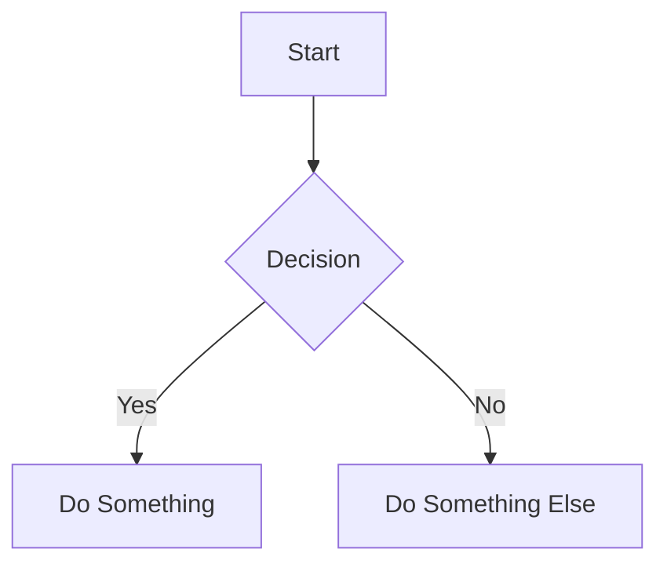

# Statamic to Saleor Migration Documentation

This directory contains the documentation for the Statamic to Saleor migration project, which is published as a GitHub Pages site.

## Documentation Structure

The documentation is organized into the following main sections:

- **Architecture**: System architecture, diagrams, API details, and data flow
- **Migration**: Migration strategy, data mapping, content migration, and testing
- **Multi-Region & Multi-Language**: Implementation details for multi-region and multi-language support
- **Development**: Development setup, local development, extending functionality, and deployment

## How to View the Documentation Locally

To view the documentation locally:

1. Make sure you have Ruby and Bundler installed
2. Install Jekyll and dependencies:
   ```
   cd docs
   bundle install
   ```
3. Run the Jekyll server:
   ```
   bundle exec jekyll serve
   ```
4. Open your browser to `http://localhost:4000`

## How to Contribute to Documentation

### Adding New Pages

1. Create a new Markdown file in the appropriate directory
2. Add the following front matter to the top of the file:
   ```yaml
   ---
   layout: default
   title: Your Page Title
   description: Brief description of the page
   parent: Parent Section (e.g., Architecture, Migration, etc.)
   ---
   ```
3. Write your content using Markdown

### Updating Existing Pages

1. Find the Markdown file for the page you want to update
2. Make your changes
3. Commit the changes to the repository

### Adding Images and Diagrams

1. Place image files in the `docs/assets/images` directory
2. Reference them in your Markdown using:
   ```markdown
   
   ```

For diagrams, use Mermaid syntax:

```markdown

```

## Documentation Publishing

The documentation is automatically published to GitHub Pages when changes are pushed to the main branch. No manual deployment is necessary.

## Documentation Standards

Please follow these standards when contributing to documentation:

1. Use clear, concise language
2. Include examples where appropriate
3. Link related content together
4. Use consistent formatting and terminology
5. Focus on multi-region and multi-language aspects when relevant
6. Add diagrams for complex concepts

## Documentation TODOs

- [ ] Add more detailed migration strategy documentation
- [ ] Expand multi-language implementation examples
- [ ] Add testing strategy details
- [ ] Include troubleshooting guides

## Contact

If you have questions about the documentation, please contact the project maintainers. 