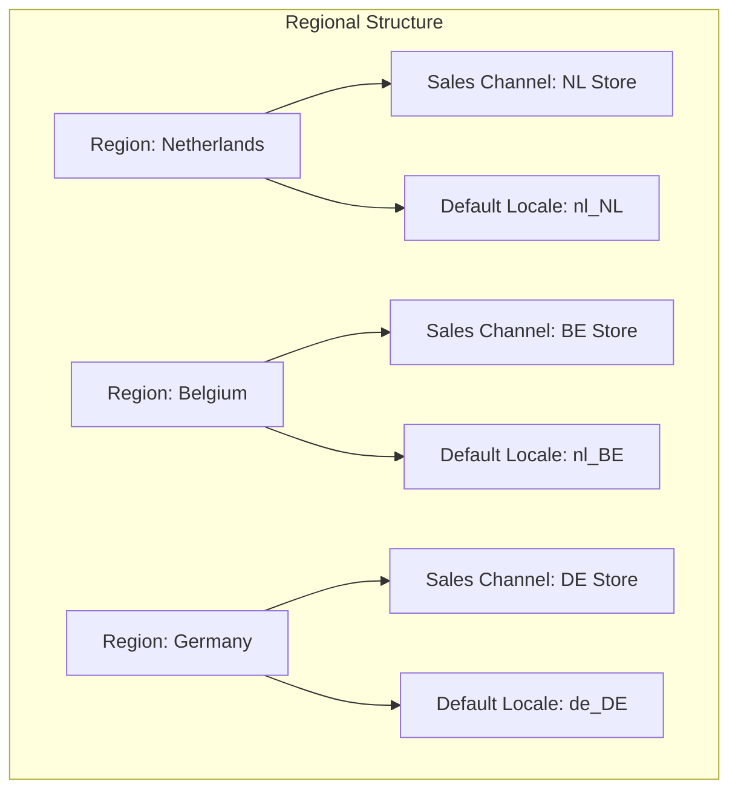
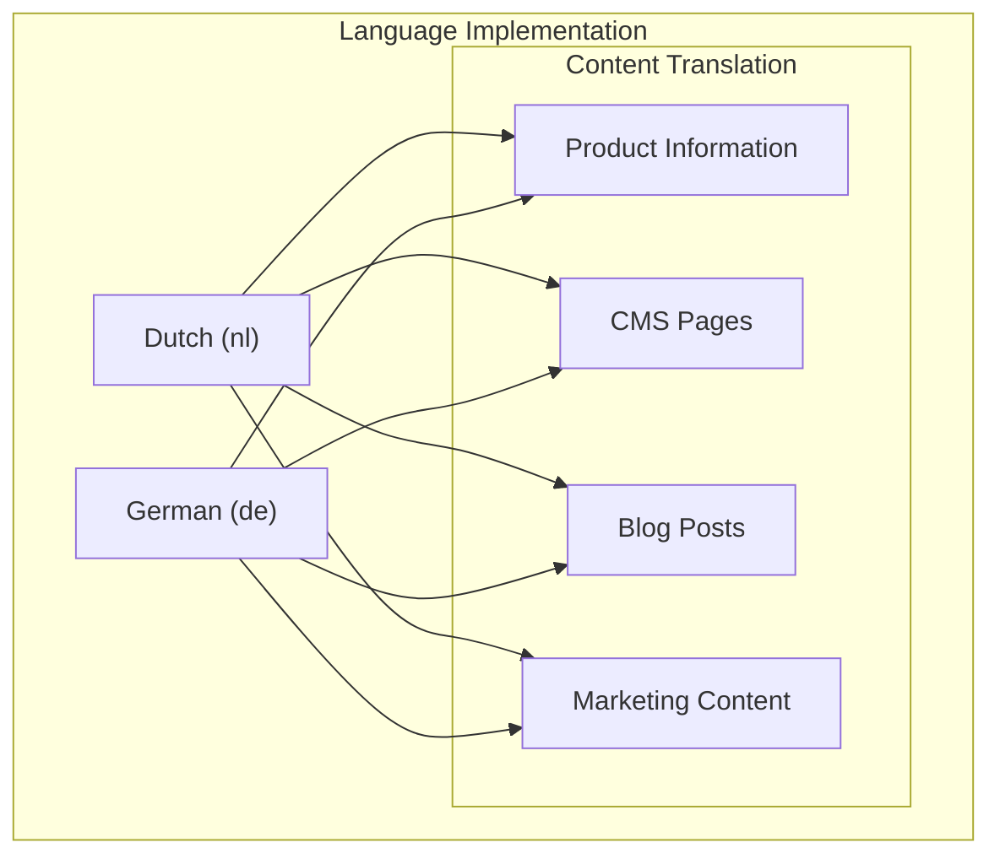
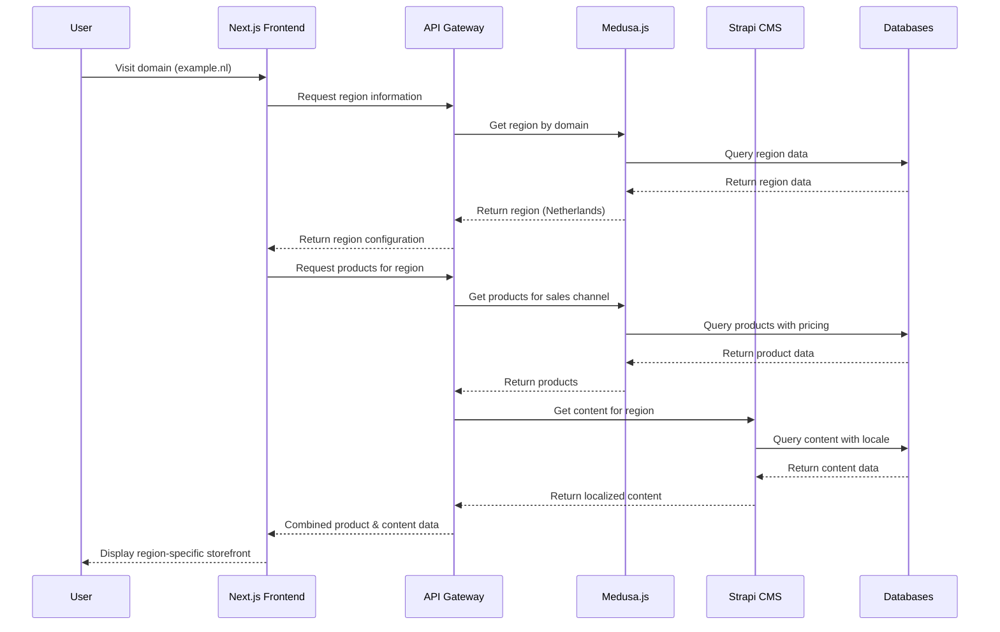
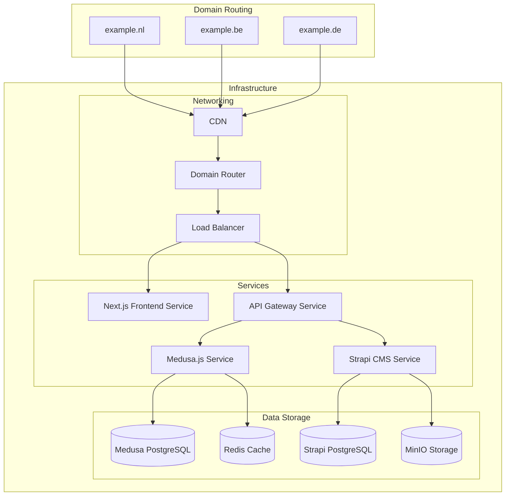
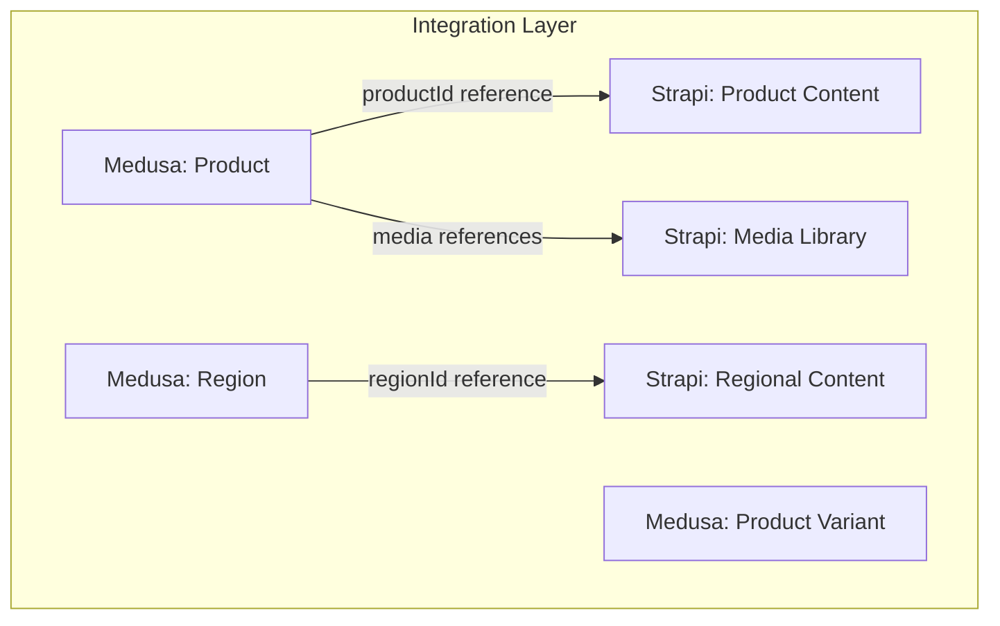
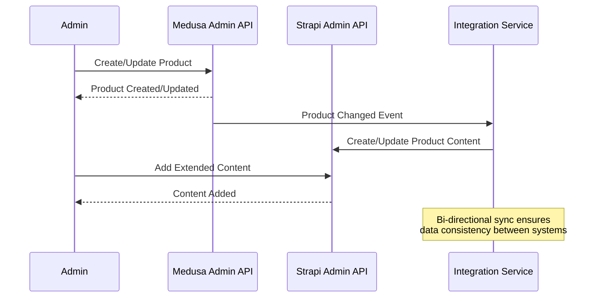

# Multi-Region E-commerce Architecture: Medusa.js + Strapi

## System Architecture Diagram

```mermaid
graph TD
    %% Client Applications
    subgraph "Client Applications"
        NL["Dutch Storefront\n(example.nl)"]
        BE["Belgian Storefront\n(example.be)"]
        DE["German Storefront\n(example.de)"]
        MobileApp["Mobile Application"]
        AdminPanel["Admin Dashboard"]
    end

    %% Frontend Layer
    subgraph "Frontend Layer"
        NextJS["Next.js Application"]
        style NextJS fill:#61DAFB,color:#000000
        
        subgraph "Storefront Features"
            Catalog["Product Catalog"]
            Cart["Shopping Cart"]
            Checkout["Checkout Flow"]
            Account["Customer Account"]
            CMS["CMS Content"]
        end
    end

    %% API Gateway Layer
    subgraph "API Gateway"
        APIGateway["API Gateway / BFF"]
        style APIGateway fill:#FF6B6B,color:#000000
    end

    %% Backend Services
    subgraph "Backend Services"
        %% Medusa.js
        subgraph "Medusa.js (Commerce Engine)"
            style Medusa fill:#9FFFCB,color:#000000
            Medusa["Medusa.js Core"]
            
            subgraph "Medusa Modules"
                Products["Products Service"]
                Orders["Orders Service"]
                Cart["Cart Service"]
                Customers["Customers Service"]
                Pricing["Pricing Service"]
                Regions["Regions Service"]
                Payments["Payments Service"]
                Shipping["Shipping Service"]
            end
        end
        
        %% Strapi CMS
        subgraph "Strapi CMS"
            style Strapi fill:#8E44AD,color:#FFFFFF
            StrapiCore["Strapi Core"]
            
            subgraph "Content Types"
                Pages["Pages"]
                BlogPosts["Blog Posts"]
                Navigation["Navigation"]
                Media["Media Library"]
                ProductContent["Product Extended Content"]
                RegionalContent["Region-Specific Content"]
            end
        end
    end

    %% Data Layer
    subgraph "Data Layer"
        MedusaDB[(Medusa PostgreSQL DB)]
        StrapiDB[(Strapi PostgreSQL DB)]
        Redis[(Redis Cache)]
        MinIO[(MinIO Object Storage)]
    end

    %% External Services
    subgraph "External Services"
        PaymentProviders["Payment Gateways\n(Stripe, iDEAL, etc.)"]
        Shipping["Shipping Providers\n(PostNL, DHL, etc.)"]
        Analytics["Analytics\n(Google, Plausible)"]
        Search["Algolia Search"]
    end

    %% Connections - User Applications to Frontend
    NL --> NextJS
    BE --> NextJS
    DE --> NextJS
    MobileApp --> APIGateway
    AdminPanel --> APIGateway

    %% Connections - Frontend to API Gateway
    NextJS --> APIGateway

    %% Connections - API Gateway to Backend Services
    APIGateway --> Medusa
    APIGateway --> StrapiCore

    %% Connections - Medusa.js Internal
    Medusa --> Products
    Medusa --> Orders
    Medusa --> Cart
    Medusa --> Customers
    Medusa --> Pricing
    Medusa --> Regions
    Medusa --> Payments
    Medusa --> Shipping

    %% Connections - Strapi Internal
    StrapiCore --> Pages
    StrapiCore --> BlogPosts
    StrapiCore --> Navigation
    StrapiCore --> Media
    StrapiCore --> ProductContent
    StrapiCore --> RegionalContent

    %% Connections - Backend to Data Layer
    Medusa -.-> MedusaDB
    Medusa -.-> Redis
    StrapiCore -.-> StrapiDB
    StrapiCore -.-> MinIO

    %% Connections - Backend to External Services
    Medusa --> PaymentProviders
    Medusa --> Shipping
    Medusa --> Analytics
    Medusa --> Search
    StrapiCore --> Analytics

    %% Integration between Medusa and Strapi
    Products <--> ProductContent
    Regions <--> RegionalContent
    
    %% Legends
    classDef service fill:#f9f,stroke:#333,stroke-width:2px;
    classDef database fill:#ccf,stroke:#333,stroke-width:2px;
    classDef client fill:#cfc,stroke:#333,stroke-width:2px;
```

## Multi-Region Implementation

The architecture implements a multi-region approach with the following key components:

### Domain Structure
- **example.nl** - Dutch storefront (Netherlands)
- **example.be** - Belgian storefront (Belgium)
- **example.de** - German storefront (Germany)

Each domain is mapped to a specific Medusa.js region and sales channel.

### Regional Configuration

### Multi-Language Support

## Data Flow Diagram

## Deployment Architecture

## Integration Points

### Medusa.js and Strapi Integration

### Data Synchronization

## Scalability Considerations

The architecture is designed to scale horizontally with the following considerations:

1. **Microservices** - Each component can scale independently
2. **Caching** - Redis caching for performance optimization
3. **CDN** - Content delivery network for static assets and pages
4. **Load Balancing** - Distribution of traffic across multiple instances
5. **Database Scaling** - Read replicas for high-traffic scenarios 