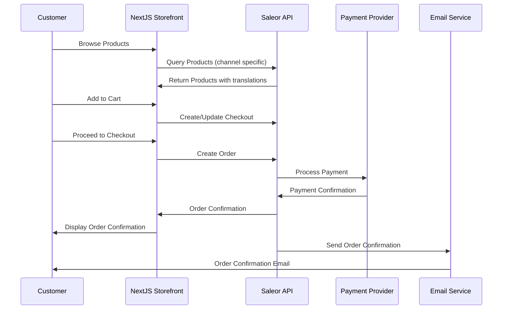
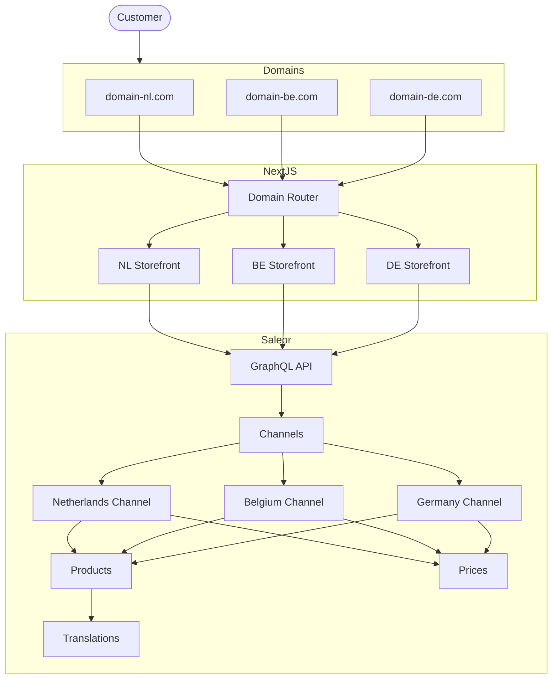
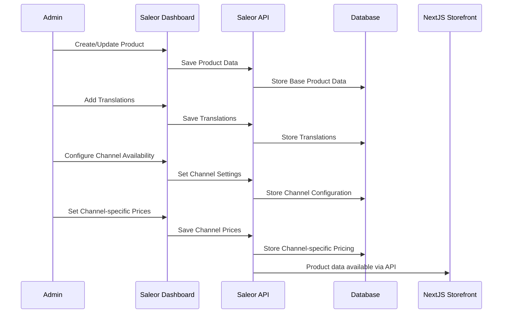
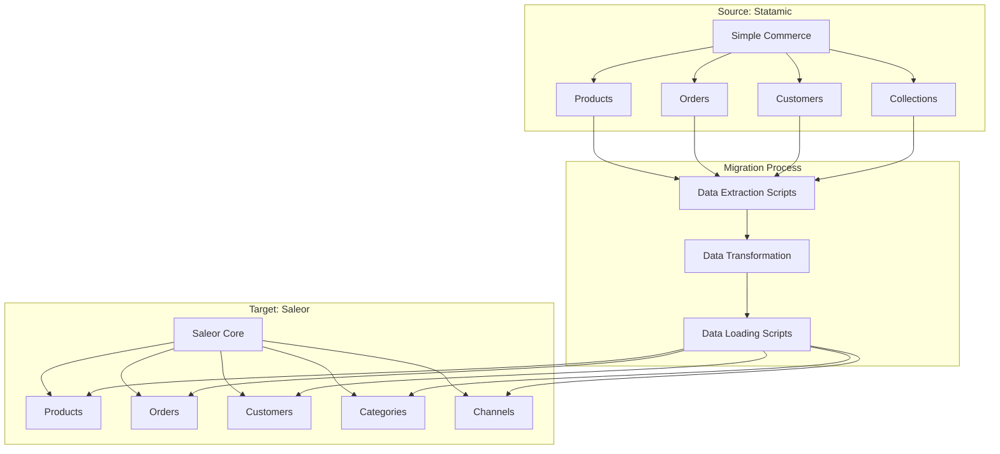
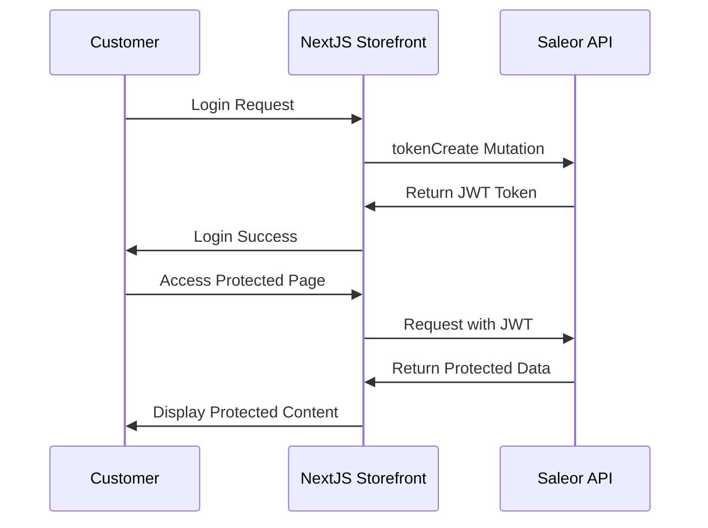
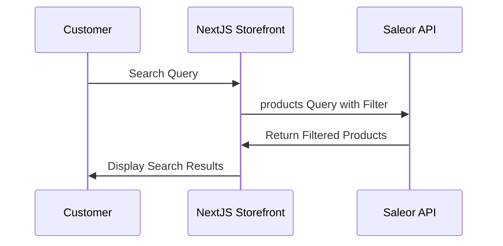
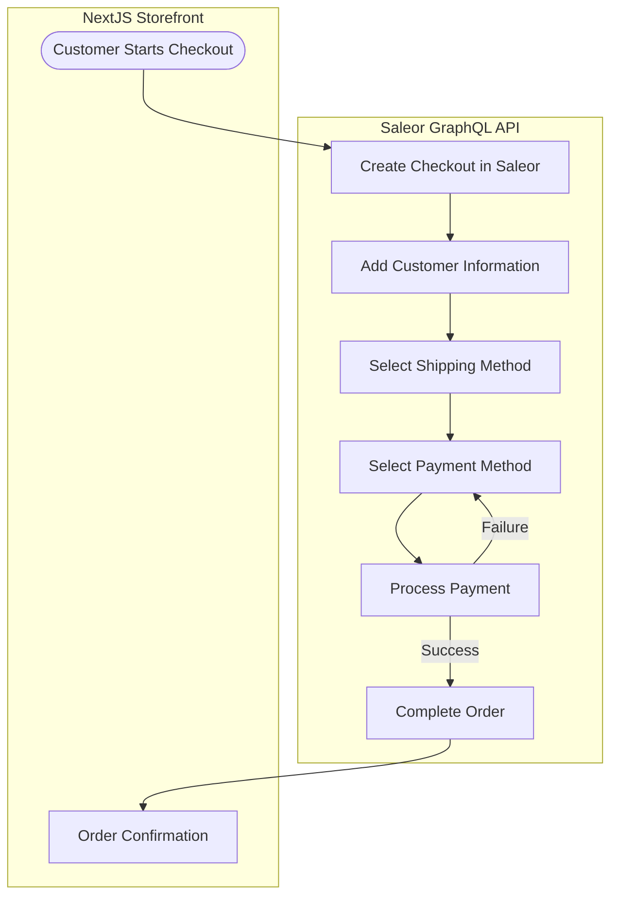

# Data Flow Diagrams

This document outlines the data flow between different components of our Saleor-based ecommerce system.

## Overview

Our architecture uses Saleor as the central ecommerce platform with a Next.js storefront for the customer-facing interface. The system handles multi-region and multi-language requirements through Saleor's Channels feature.

## Customer Purchase Flow

## Multi-Region Data Flow

## Product Creation and Update Flow

## Migration Data Flow

The migration from Statamic and Simple Commerce to Saleor will follow this flow:

## Authentication Flow

## Search Flow

## Checkout Flow

