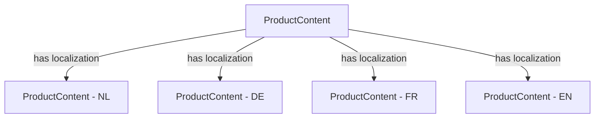

# Data Model & Schema Design

This document outlines the data model and schema design for the migration from Statamic CMS and Simple Commerce to Medusa.js and Strapi CMS, with special attention to multi-region and multi-language support.

## Table of Contents

1. [Current Data Model (Statamic)](#current-data-model-statamic)
2. [Target Data Model](#target-data-model)
   - [Medusa.js Commerce Data](#medusajs-commerce-data)
   - [Strapi Content Data](#strapi-content-data)
   - [Integration Layer Data](#integration-layer-data)
3. [Data Model Mappings](#data-model-mappings)
4. [Multi-Region Schema Design](#multi-region-schema-design)
5. [Multi-Language Schema Design](#multi-language-schema-design)
6. [Database Schemas](#database-schemas)
7. [Data Validation Rules](#data-validation-rules)

## Current Data Model (Statamic)

The current Statamic implementation uses a flat file structure with the following core collections:

### Product Collection

```yaml
# Example Statamic Product Entry (YAML)
title: Premium Widget
slug: premium-widget
id: product_123
price: 99.95
tax_rate: 0.21
stock: 150
categories:
  - widgets
  - premium
description: >
  A high-quality premium widget with enhanced features.
features:
  - Durable construction
  - Lifetime warranty
  - Premium materials
images:
  - /assets/products/premium-widget-1.jpg
  - /assets/products/premium-widget-2.jpg
specifications:
  weight: 1.2
  dimensions: '10 x 5 x 3'
  color: Silver
variants:
  - name: Standard
    price: 99.95
    sku: PWS001
  - name: Deluxe
    price: 149.95
    sku: PWD001
related_products:
  - product_124
  - product_125
meta_title: Premium Widget | Our Store
meta_description: Premium Widget with enhanced features and lifetime warranty.
```

### Category Collection

```yaml
# Example Statamic Category Entry (YAML)
title: Widgets
slug: widgets
id: category_001
description: All widget products
parent: null
image: /assets/categories/widgets.jpg
featured: true
products_count: 15
meta_title: Widgets | Our Store
meta_description: Browse our collection of high-quality widgets.
```

### Order Collection

```yaml
# Example Statamic Order Entry (YAML)
id: order_456
status: completed
customer: customer_789
date: 2023-05-15
total: 249.90
tax_total: 43.32
shipping_total: 5.95
items:
  - product: product_123
    variant: Standard
    quantity: 2
    price: 99.95
    tax: 41.98
shipping_address:
  name: John Doe
  address_1: 123 Main St
  address_2: Apt 4B
  city: Amsterdam
  postal_code: 1000 AB
  country: Netherlands
payment_method: stripe
payment_id: pi_123456789
notes: Please leave at front door
```

### Customer Collection

```yaml
# Example Statamic Customer Entry (YAML)
id: customer_789
email: john@example.com
first_name: John
last_name: Doe
password: hashed_password
addresses:
  - name: Home
    address_1: 123 Main St
    address_2: Apt 4B
    city: Amsterdam
    postal_code: 1000 AB
    country: Netherlands
    default: true
orders:
  - order_456
  - order_457
created_at: 2023-01-10
```

## Target Data Model

### Medusa.js Commerce Data

#### Product Model

```typescript
interface Product {
  id: string;
  title: string;
  subtitle?: string;
  description?: string;
  handle: string; // URL slug
  is_giftcard: boolean;
  status: 'draft' | 'proposed' | 'published' | 'rejected';
  images: Image[];
  thumbnail?: string;
  options: ProductOption[];
  variants: ProductVariant[];
  categories: ProductCategory[];
  tags: ProductTag[];
  discountable: boolean;
  external_id?: string; // Reference to Strapi content
  metadata: Record<string, unknown>; // For custom fields
  created_at: Date;
  updated_at: Date;
}

interface ProductVariant {
  id: string;
  title: string;
  product_id: string;
  sku?: string;
  barcode?: string;
  ean?: string;
  upc?: string;
  inventory_quantity: number;
  allow_backorder: boolean;
  manage_inventory: boolean;
  hs_code?: string;
  origin_country?: string;
  mid_code?: string;
  material?: string;
  weight?: number;
  length?: number;
  height?: number;
  width?: number;
  options: ProductOptionValue[];
  prices: MoneyAmount[];
  metadata: Record<string, unknown>;
  created_at: Date;
  updated_at: Date;
}
```

#### Region Model

```typescript
interface Region {
  id: string;
  name: string;
  currency_code: string;
  tax_rate: number;
  tax_code?: string;
  gift_cards_taxable: boolean;
  automatic_taxes: boolean;
  countries: Country[];
  payment_providers: PaymentProvider[];
  fulfillment_providers: FulfillmentProvider[];
  includes_tax: boolean;
  metadata: Record<string, unknown>;
  created_at: Date;
  updated_at: Date;
}

interface Country {
  id: string;
  iso_2: string;
  iso_3: string;
  num_code: string;
  name: string;
  display_name: string;
  region_id?: string;
}
```

#### Order Model

```typescript
interface Order {
  id: string;
  status: OrderStatus;
  fulfillment_status: FulfillmentStatus;
  payment_status: PaymentStatus;
  display_id: string;
  cart_id?: string;
  customer_id: string;
  email: string;
  billing_address_id?: string;
  shipping_address_id?: string;
  region_id: string;
  currency_code: string;
  tax_rate?: number;
  items: LineItem[];
  payments: Payment[];
  fulfillments: Fulfillment[];
  shipping_methods: ShippingMethod[];
  discounts: Discount[];
  gift_cards: GiftCard[];
  customer: Customer;
  region: Region;
  shipping_address?: Address;
  billing_address?: Address;
  metadata: Record<string, unknown>;
  created_at: Date;
  updated_at: Date;
}
```

#### Customer Model

```typescript
interface Customer {
  id: string;
  email: string;
  first_name?: string;
  last_name?: string;
  billing_address_id?: string;
  password_hash?: string;
  phone?: string;
  has_account: boolean;
  addresses: Address[];
  orders: Order[];
  metadata: Record<string, unknown>;
  created_at: Date;
  updated_at: Date;
}
```

### Strapi Content Data

#### Extended Product Content

```typescript
interface ProductContent {
  id: number;
  medusa_id: string; // Reference to Medusa.js product
  slug: string;
  locale: string;
  title: string;
  long_description: string;
  features: string[];
  specifications: Record<string, unknown>;
  warranty_info: string;
  care_instructions: string;
  faq: Array<{
    question: string;
    answer: string;
  }>;
  videos: Array<{
    title: string;
    url: string;
    type: 'youtube' | 'vimeo' | 'custom';
  }>;
  documents: Media[];
  related_articles: Article[];
  seo: {
    meta_title: string;
    meta_description: string;
    canonical_url?: string;
    og_image?: Media;
    keywords: string[];
  };
  components: Array<{
    __component: string;
    [key: string]: unknown;
  }>;
  published_at: Date;
  created_at: Date;
  updated_at: Date;
}
```

#### Category Content

```typescript
interface CategoryContent {
  id: number;
  medusa_id: string; // Reference to Medusa.js category
  slug: string;
  locale: string;
  title: string;
  description: string;
  banner_image: Media;
  icon?: Media;
  featured: boolean;
  display_order: number;
  parent_category?: CategoryContent;
  child_categories: CategoryContent[];
  seo: {
    meta_title: string;
    meta_description: string;
    canonical_url?: string;
    og_image?: Media;
    keywords: string[];
  };
  components: Array<{
    __component: string;
    [key: string]: unknown;
  }>;
  published_at: Date;
  created_at: Date;
  updated_at: Date;
}
```

#### Article

```typescript
interface Article {
  id: number;
  slug: string;
  locale: string;
  title: string;
  summary: string;
  content: string;
  featured_image: Media;
  author: Author;
  categories: ArticleCategory[];
  tags: Tag[];
  related_products: ProductContent[];
  seo: {
    meta_title: string;
    meta_description: string;
    canonical_url?: string;
    og_image?: Media;
    keywords: string[];
  };
  components: Array<{
    __component: string;
    [key: string]: unknown;
  }>;
  published_at: Date;
  created_at: Date;
  updated_at: Date;
}
```

#### Landing Page

```typescript
interface LandingPage {
  id: number;
  slug: string;
  locale: string;
  title: string;
  sections: Array<{
    __component: string;
    [key: string]: unknown;
  }>;
  seo: {
    meta_title: string;
    meta_description: string;
    canonical_url?: string;
    og_image?: Media;
    keywords: string[];
  };
  published_at: Date;
  created_at: Date;
  updated_at: Date;
}
```

### Integration Layer Data

#### ID Mapping

```typescript
interface IdMapping {
  id: string;
  medusa_id: string;
  strapi_id: number;
  entity_type: 'product' | 'category' | 'collection';
  created_at: Date;
  updated_at: Date;
}
```

#### Sync Log

```typescript
interface SyncLog {
  id: string;
  source_system: 'medusa' | 'strapi';
  source_entity_type: string;
  source_entity_id: string;
  target_system: 'medusa' | 'strapi';
  target_entity_type: string;
  target_entity_id: string;
  operation: 'create' | 'update' | 'delete';
  status: 'pending' | 'success' | 'failed';
  error_message?: string;
  sync_details: Record<string, unknown>;
  created_at: Date;
  updated_at: Date;
}
```

#### Region Configuration

```typescript
interface RegionConfiguration {
  id: string;
  region_id: string; // Medusa region ID
  code: string; // Region code (e.g., 'nl', 'de', 'be')
  name: string;
  domain: string; // e.g., 'example.nl', 'example.de'
  languages: string[]; // Supported languages for region
  default_language: string;
  currency_code: string;
  active: boolean;
  metadata: Record<string, unknown>;
  created_at: Date;
  updated_at: Date;
}
```

## Data Model Mappings

The following table describes how the Statamic data model will be mapped to the Medusa.js and Strapi models:

| Statamic Entity | Medusa.js Entity | Strapi Entity | Notes |
|-----------------|------------------|---------------|-------|
| Product         | Product          | ProductContent | Commerce data in Medusa, enhanced content in Strapi |
| Product Variants | ProductVariant   | - | Handled entirely by Medusa.js |
| Category        | ProductCategory  | CategoryContent | Base category in Medusa, enhanced content in Strapi |
| Order           | Order            | - | Handled entirely by Medusa.js |
| Customer        | Customer         | - | Handled entirely by Medusa.js |
| Assets          | Image            | Media | Medusa handles product images, Strapi handles all other media |
| Pages           | -                | LandingPage | Moved entirely to Strapi |
| Blog/Articles   | -                | Article | Moved entirely to Strapi |

### Field Level Mapping Example (Product)

| Statamic Field | Medusa.js Field | Strapi Field | Notes |
|----------------|-----------------|--------------|-------|
| title          | title           | title        | Synced in both directions |
| slug           | handle          | slug         | Synced in both directions |
| id             | id              | medusa_id    | Medusa is source of truth for IDs |
| price          | variants[].prices | -           | Medusa is source of truth for pricing |
| tax_rate       | region.tax_rate | -           | Now region-specific in Medusa |
| stock          | variants[].inventory_quantity | - | Medusa is source of truth for inventory |
| categories     | categories      | -           | References maintained in Medusa |
| description    | description     | long_description | Short in Medusa, extended in Strapi |
| features       | metadata.features | features    | Basic in Medusa metadata, rich in Strapi |
| images         | images          | -           | Managed in Medusa |
| specifications | metadata.specs  | specifications | Basic in Medusa metadata, rich in Strapi |
| variants       | variants        | -           | Managed entirely in Medusa |
| related_products | -             | related_products | Managed in Strapi |
| meta_title     | -               | seo.meta_title | Moved to Strapi |
| meta_description | -             | seo.meta_description | Moved to Strapi |

## Multi-Region Schema Design

The multi-region support is primarily implemented in Medusa.js using its built-in Regions feature, with additional configuration in the Integration Layer.

### Medusa.js Region Structure

```
┌──────────────────────┐
│ Region: Netherlands  │
│  - Currency: EUR     │
│  - Countries: NL     │
│  - Tax Rate: 21%     │
└──────────────────────┘
           │
           ▼
┌──────────────────────────────────────────┐
│ ProductVariant                           │
│  - Prices:                               │
│    * Money Amount (Region: NL, EUR 99.95)│
│    * Money Amount (Region: DE, EUR 99.95)│
│    * Money Amount (Region: BE, EUR 99.95)│
└──────────────────────────────────────────┘
```

### Integration Layer Region Configuration

```json
{
  "regions": [
    {
      "id": "reg_123",
      "code": "nl",
      "name": "Netherlands",
      "domain": "example.nl",
      "languages": ["nl", "en"],
      "default_language": "nl",
      "currency_code": "EUR",
      "medusa_region_id": "reg_nl_123"
    },
    {
      "id": "reg_124",
      "code": "de",
      "name": "Germany",
      "domain": "example.de",
      "languages": ["de", "en"],
      "default_language": "de",
      "currency_code": "EUR",
      "medusa_region_id": "reg_de_123"
    },
    {
      "id": "reg_125",
      "code": "be",
      "name": "Belgium",
      "domain": "example.be",
      "languages": ["nl", "fr", "en"],
      "default_language": "nl",
      "currency_code": "EUR",
      "medusa_region_id": "reg_be_123"
    }
  ]
}
```

## Multi-Language Schema Design

The multi-language support is primarily implemented in Strapi, using its built-in localization feature.

### Strapi Localization



### Example Localized Content

```json
{
  "id": 1,
  "medusa_id": "prod_123",
  "slug": "premium-widget",
  "locale": "en",
  "localizations": [2, 3, 4],
  "title": "Premium Widget",
  "long_description": "A high-quality premium widget with enhanced features.",
  "features": ["Durable construction", "Lifetime warranty", "Premium materials"],
  "seo": {
    "meta_title": "Premium Widget | Our Store",
    "meta_description": "Premium Widget with enhanced features and lifetime warranty."
  }
}
```

```json
{
  "id": 2,
  "medusa_id": "prod_123",
  "slug": "premium-widget",
  "locale": "nl",
  "localizations": [1, 3, 4],
  "title": "Premium Widget",
  "long_description": "Een hoogwaardige premium widget met verbeterde functies.",
  "features": ["Duurzame constructie", "Levenslange garantie", "Premium materialen"],
  "seo": {
    "meta_title": "Premium Widget | Onze Winkel",
    "meta_description": "Premium Widget met verbeterde functies en levenslange garantie."
  }
}
```

## Database Schemas

### Medusa.js Database (PostgreSQL)

Medusa.js uses a relational database with the following core tables:

```sql
CREATE TABLE "product" (
  "id" character varying NOT NULL,
  "title" character varying NOT NULL,
  "subtitle" character varying,
  "description" character varying,
  "handle" character varying NOT NULL,
  "is_giftcard" boolean NOT NULL DEFAULT false,
  "status" product_status_enum NOT NULL DEFAULT 'draft',
  "thumbnail" character varying,
  "profile_id" character varying NOT NULL,
  "weight" integer,
  "length" integer,
  "height" integer,
  "width" integer,
  "hs_code" character varying,
  "origin_country" character varying,
  "mid_code" character varying,
  "material" character varying,
  "collection_id" character varying,
  "type_id" character varying,
  "discountable" boolean NOT NULL DEFAULT true,
  "external_id" character varying,
  "metadata" jsonb,
  "created_at" TIMESTAMP WITH TIME ZONE NOT NULL DEFAULT now(),
  "updated_at" TIMESTAMP WITH TIME ZONE NOT NULL DEFAULT now(),
  "deleted_at" TIMESTAMP WITH TIME ZONE,
  CONSTRAINT "PK_product" PRIMARY KEY ("id")
);

CREATE TABLE "product_variant" (
  "id" character varying NOT NULL,
  "title" character varying NOT NULL,
  "product_id" character varying NOT NULL,
  "sku" character varying,
  "barcode" character varying,
  "ean" character varying,
  "upc" character varying,
  "variant_rank" integer,
  "inventory_quantity" integer NOT NULL,
  "allow_backorder" boolean NOT NULL DEFAULT false,
  "manage_inventory" boolean NOT NULL DEFAULT true,
  "hs_code" character varying,
  "origin_country" character varying,
  "mid_code" character varying,
  "material" character varying,
  "weight" integer,
  "length" integer,
  "height" integer,
  "width" integer,
  "metadata" jsonb,
  "created_at" TIMESTAMP WITH TIME ZONE NOT NULL DEFAULT now(),
  "updated_at" TIMESTAMP WITH TIME ZONE NOT NULL DEFAULT now(),
  "deleted_at" TIMESTAMP WITH TIME ZONE,
  CONSTRAINT "PK_product_variant" PRIMARY KEY ("id")
);

CREATE TABLE "region" (
  "id" character varying NOT NULL,
  "name" character varying NOT NULL,
  "currency_code" character varying NOT NULL,
  "tax_rate" numeric,
  "tax_code" character varying,
  "gift_cards_taxable" boolean NOT NULL DEFAULT true,
  "automatic_taxes" boolean NOT NULL DEFAULT true,
  "includes_tax" boolean NOT NULL DEFAULT false,
  "metadata" jsonb,
  "created_at" TIMESTAMP WITH TIME ZONE NOT NULL DEFAULT now(),
  "updated_at" TIMESTAMP WITH TIME ZONE NOT NULL DEFAULT now(),
  "deleted_at" TIMESTAMP WITH TIME ZONE,
  CONSTRAINT "PK_region" PRIMARY KEY ("id")
);
```

### Strapi Database (PostgreSQL or SQLite)

Strapi uses a dynamic schema based on content types, with core tables including:

```sql
CREATE TABLE "product_contents" (
  "id" integer NOT NULL GENERATED ALWAYS AS IDENTITY,
  "medusa_id" character varying NOT NULL,
  "slug" character varying NOT NULL,
  "locale" character varying NOT NULL,
  "title" character varying NOT NULL,
  "long_description" text,
  "features" jsonb,
  "specifications" jsonb,
  "warranty_info" text,
  "care_instructions" text,
  "faq" jsonb,
  "videos" jsonb,
  "seo" jsonb,
  "published_at" TIMESTAMP WITH TIME ZONE,
  "created_at" TIMESTAMP WITH TIME ZONE DEFAULT now(),
  "updated_at" TIMESTAMP WITH TIME ZONE DEFAULT now(),
  CONSTRAINT "PK_product_contents" PRIMARY KEY ("id")
);

CREATE TABLE "product_contents_localizations_links" (
  "id" integer NOT NULL GENERATED ALWAYS AS IDENTITY,
  "product_content_id" integer,
  "inv_product_content_id" integer,
  "product_content_order" integer,
  CONSTRAINT "PK_product_contents_localizations_links" PRIMARY KEY ("id")
);

CREATE TABLE "category_contents" (
  "id" integer NOT NULL GENERATED ALWAYS AS IDENTITY,
  "medusa_id" character varying NOT NULL,
  "slug" character varying NOT NULL,
  "locale" character varying NOT NULL,
  "title" character varying NOT NULL,
  "description" text,
  "featured" boolean DEFAULT false,
  "display_order" integer DEFAULT 0,
  "seo" jsonb,
  "published_at" TIMESTAMP WITH TIME ZONE,
  "created_at" TIMESTAMP WITH TIME ZONE DEFAULT now(),
  "updated_at" TIMESTAMP WITH TIME ZONE DEFAULT now(),
  CONSTRAINT "PK_category_contents" PRIMARY KEY ("id")
);
```

### Integration Layer Database (PostgreSQL)

```sql
CREATE TABLE "id_mappings" (
  "id" uuid NOT NULL DEFAULT gen_random_uuid(),
  "medusa_id" character varying NOT NULL,
  "strapi_id" integer NOT NULL,
  "entity_type" character varying NOT NULL,
  "created_at" TIMESTAMP WITH TIME ZONE NOT NULL DEFAULT now(),
  "updated_at" TIMESTAMP WITH TIME ZONE NOT NULL DEFAULT now(),
  CONSTRAINT "PK_id_mappings" PRIMARY KEY ("id"),
  CONSTRAINT "UQ_medusa_id_entity_type" UNIQUE ("medusa_id", "entity_type"),
  CONSTRAINT "UQ_strapi_id_entity_type" UNIQUE ("strapi_id", "entity_type")
);

CREATE TABLE "sync_logs" (
  "id" uuid NOT NULL DEFAULT gen_random_uuid(),
  "source_system" character varying NOT NULL,
  "source_entity_type" character varying NOT NULL,
  "source_entity_id" character varying NOT NULL,
  "target_system" character varying NOT NULL,
  "target_entity_type" character varying NOT NULL,
  "target_entity_id" character varying,
  "operation" character varying NOT NULL,
  "status" character varying NOT NULL,
  "error_message" text,
  "sync_details" jsonb,
  "created_at" TIMESTAMP WITH TIME ZONE NOT NULL DEFAULT now(),
  "updated_at" TIMESTAMP WITH TIME ZONE NOT NULL DEFAULT now(),
  CONSTRAINT "PK_sync_logs" PRIMARY KEY ("id")
);

CREATE TABLE "region_configurations" (
  "id" uuid NOT NULL DEFAULT gen_random_uuid(),
  "region_id" character varying NOT NULL,
  "code" character varying NOT NULL,
  "name" character varying NOT NULL,
  "domain" character varying NOT NULL,
  "languages" jsonb NOT NULL,
  "default_language" character varying NOT NULL,
  "currency_code" character varying NOT NULL,
  "active" boolean NOT NULL DEFAULT true,
  "metadata" jsonb,
  "created_at" TIMESTAMP WITH TIME ZONE NOT NULL DEFAULT now(),
  "updated_at" TIMESTAMP WITH TIME ZONE NOT NULL DEFAULT now(),
  CONSTRAINT "PK_region_configurations" PRIMARY KEY ("id"),
  CONSTRAINT "UQ_region_id" UNIQUE ("region_id"),
  CONSTRAINT "UQ_code" UNIQUE ("code"),
  CONSTRAINT "UQ_domain" UNIQUE ("domain")
);
```

## Data Validation Rules

### Product Validation

```typescript
const productValidationSchema = {
  title: {
    type: 'string',
    required: true,
    minLength: 2,
    maxLength: 255
  },
  handle: {
    type: 'string',
    required: true,
    pattern: /^[a-z0-9]+(?:-[a-z0-9]+)*$/,
    minLength: 2,
    maxLength: 255
  },
  description: {
    type: 'string',
    maxLength: 2000
  },
  variants: {
    type: 'array',
    required: true,
    minItems: 1,
    items: {
      type: 'object',
      properties: {
        title: {
          type: 'string',
          required: true,
          minLength: 1
        },
        prices: {
          type: 'array',
          required: true,
          minItems: 1
        }
      }
    }
  }
};
```

### Product Content Validation

```typescript
const productContentValidationSchema = {
  medusa_id: {
    type: 'string',
    required: true
  },
  slug: {
    type: 'string',
    required: true,
    pattern: /^[a-z0-9]+(?:-[a-z0-9]+)*$/
  },
  locale: {
    type: 'string',
    required: true,
    enum: ['en', 'nl', 'de', 'fr']
  },
  title: {
    type: 'string',
    required: true,
    minLength: 2,
    maxLength: 255
  },
  long_description: {
    type: 'string',
    required: true
  },
  features: {
    type: 'array',
    items: {
      type: 'string'
    }
  },
  seo: {
    type: 'object',
    properties: {
      meta_title: {
        type: 'string',
        required: true,
        maxLength: 60
      },
      meta_description: {
        type: 'string',
        required: true,
        maxLength: 160
      }
    }
  }
};
```

### Region Configuration Validation

```typescript
const regionConfigValidationSchema = {
  region_id: {
    type: 'string',
    required: true
  },
  code: {
    type: 'string',
    required: true,
    pattern: /^[a-z]{2}$/
  },
  name: {
    type: 'string',
    required: true
  },
  domain: {
    type: 'string',
    required: true,
    pattern: /^[a-z0-9]+([\-\.]{1}[a-z0-9]+)*\.[a-z]{2,}$/
  },
  languages: {
    type: 'array',
    required: true,
    minItems: 1,
    items: {
      type: 'string',
      enum: ['en', 'nl', 'de', 'fr']
    }
  },
  default_language: {
    type: 'string',
    required: true,
    enum: ['en', 'nl', 'de', 'fr']
  },
  currency_code: {
    type: 'string',
    required: true,
    enum: ['EUR']
  }
};
```

## Conclusion

This data model design provides a comprehensive blueprint for the migration from Statamic to Medusa.js and Strapi, with robust support for multi-region and multi-language capabilities. The design enables:

1. Clear separation between commerce data (Medusa.js) and content data (Strapi)
2. Efficient synchronization through the Integration Layer
3. Region-specific configuration with multiple domains and languages
4. Localized content for all regions and languages
5. Strict validation to ensure data integrity

The implementation phase should follow this data model closely, with monitoring to ensure consistency across all systems. 