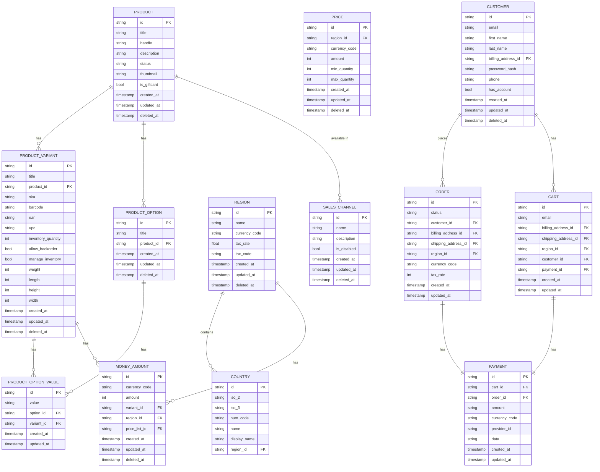

# Entity-Relationship Diagram: Medusa.js and Strapi Integration

## Overview

This document presents the Entity-Relationship Diagrams (ERDs) for our multi-region, multi-language e-commerce implementation using Medusa.js and Strapi CMS. These diagrams illustrate the core data models, relationships, and integration points between both systems.

## Medusa.js Core Entities

## Strapi CMS Entities

## Integration Points

## Multi-Region Structure

## Data Migration Mappings

## Indexing and Performance Considerations

- Primary indexes on all ID fields
- Secondary indexes on:
  - Product handles
  - SKUs and barcodes
  - Email addresses
  - Currency codes
  - Region identifiers

- Composite indexes on:
  - (product_id, variant_id) for quick variant lookup
  - (region_id, currency_code) for region-specific pricing
  - (locale, entity_id) for fast translation lookup

## Migration Tracking Fields

All entities in both Medusa.js and Strapi will include these additional fields for migration tracking:

- `migration_source_id`: Reference to original Statamic ID
- `migration_status`: Enum (pending, in_progress, completed, error)
- `migration_notes`: Text field for any migration-specific notes
- `last_synced_at`: Timestamp of last synchronization
- `data_verified`: Boolean indicating if data has been verified

This ERD provides a comprehensive overview of our data structure across both Medusa.js and Strapi CMS, highlighting key entities, relationships, and integration points essential for our multi-region e-commerce implementation. 