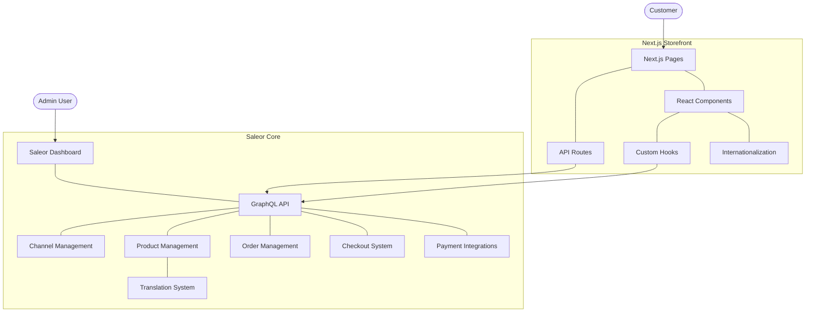
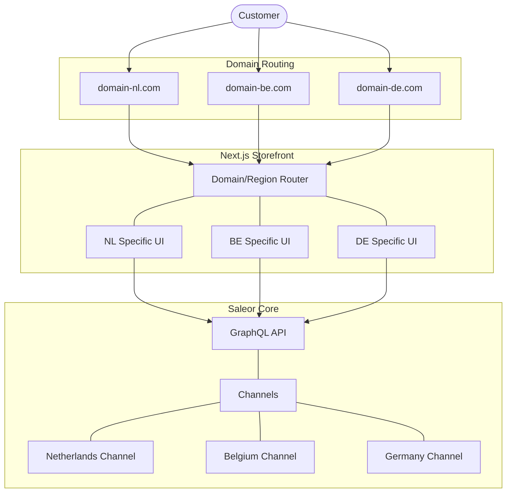
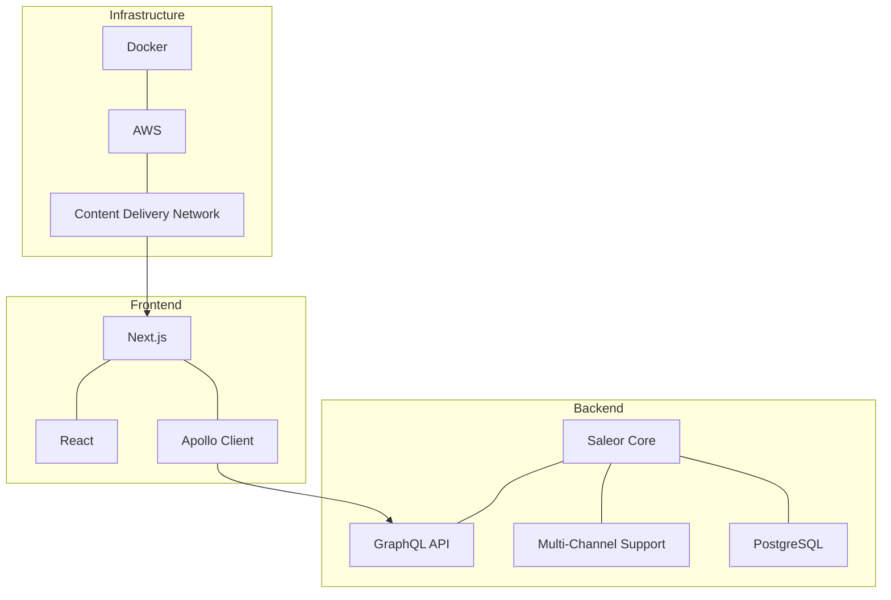
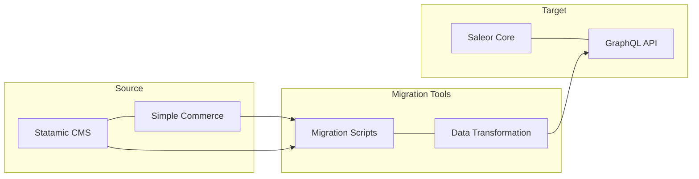
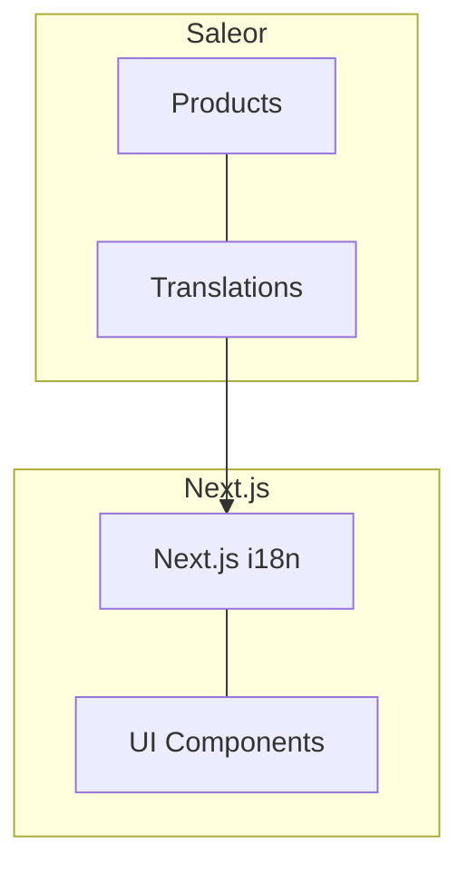
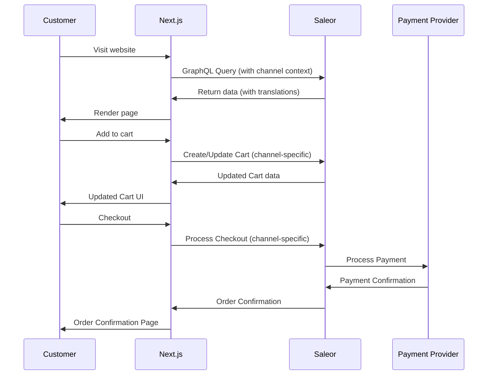
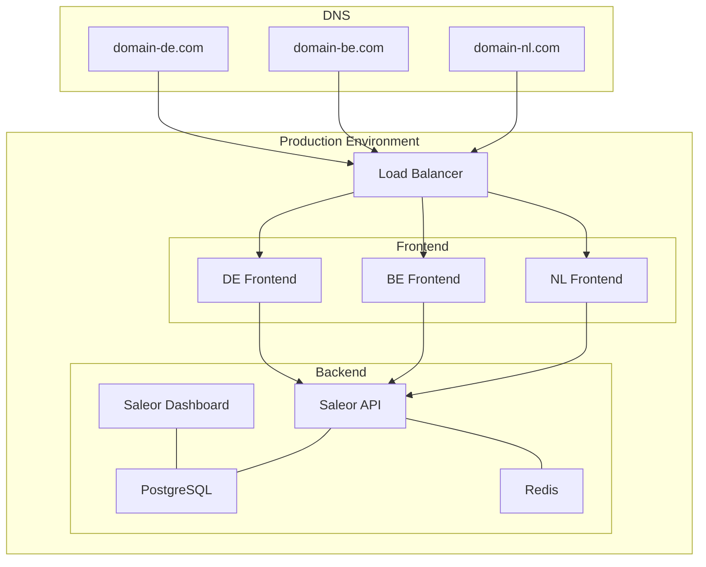

# Architecture Diagrams

This page provides visual representations of the architecture for the Statamic to Saleor migration project, with a focus on multi-region and multi-language capabilities.

## PlantUML Diagrams

We have created detailed technical diagrams using PlantUML to visualize key aspects of our architecture:

### Main Architecture Diagram

*Full architecture diagram showing the layered approach of our Saleor implementation*

### Multi-Region Architecture

*Detailed view of the multi-region implementation using Saleor Channels*

### Multi-Language Architecture

*Detailed view of the multi-language implementation with Next.js i18n integration*

### Data Flow Diagram

*Visualization of data flow between system components*

### Data Migration Diagram

*Diagram showing the migration path from Statamic to Saleor*

## System Overview Diagram

The following diagram shows the high-level system architecture:

## Multi-Region Architecture (Mermaid)

The following diagram illustrates the multi-region architecture using Saleor Channels:

## Technology Stack Diagram

This diagram shows the technology stack and relationships between components:

## Data Migration Flow

This diagram illustrates the data migration process from Statamic to Saleor:

## Multi-Language Support (Mermaid)

This diagram shows how multi-language support is implemented:

## Data Flow Diagram (Mermaid)

This diagram illustrates the flow of data during customer interactions:

## Deployment Architecture

This diagram shows the deployment architecture for the system:

This architecture is designed to leverage Saleor's Channel feature for comprehensive multi-region support, while providing a flexible and performant framework for multi-language capabilities across all storefronts. 