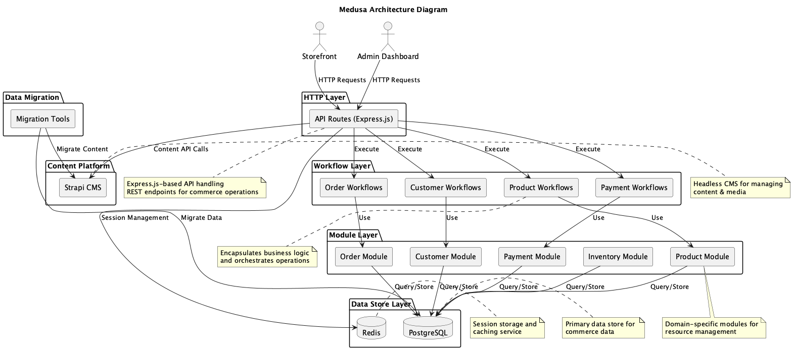

# System Diagrams

This section contains visual representations of the system architecture and components.

## Main Architecture Diagram

The main architecture diagram illustrates the high-level structure of the Statamic to Medusa.js migration project, including all major components and their relationships.

[View SVG version](architecture-diagram.svg) | [View Source](https://github.com/yourusername/yourrepo/blob/main/src/architecture/diagrams/architecture-diagram.puml)

## Component Descriptions

### Frontend Tier
The user-facing application built with Next.js that provides a responsive, fast-loading interface for customers. It communicates with the backend through the API Gateway.

### API Gateway
Acts as a unified entry point for all client requests, routing them to the appropriate services (Commerce Platform or Content Platform) based on the request type.

### Commerce Platform (Medusa.js)
Handles all e-commerce functionality, including:
- Product catalog management
- Cart and checkout processing
- Order management
- Inventory tracking
- Payment processing
- Shipping options

### Content Platform (Strapi)
Manages all content-related functionality:
- CMS capabilities
- Blog posts and articles
- Marketing content
- Media assets
- SEO metadata

### Data Layer
Includes databases and storage systems that persist all application data:
- PostgreSQL for structured data
- Redis for caching
- File storage for media and assets

### Infrastructure
Cloud services and supporting infrastructure:
- Containerized deployment
- Load balancing
- CDN integration
- Monitoring and logging

### Data Migration
Components responsible for transferring data from the legacy Statamic system to the new Medusa.js and Strapi platforms:
- Data extraction scripts
- Transformation utilities
- Validation tools
- Import processes

## Additional Diagrams

The following additional diagrams will be added as they are developed:

- Data Flow Diagram
- Deployment Architecture
- Sequence Diagrams for Key Processes
- Entity Relationship Diagram 