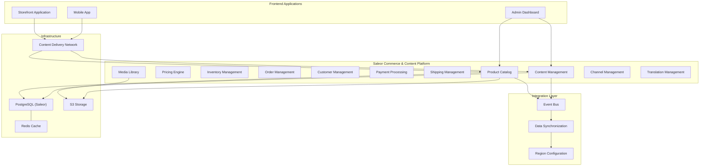
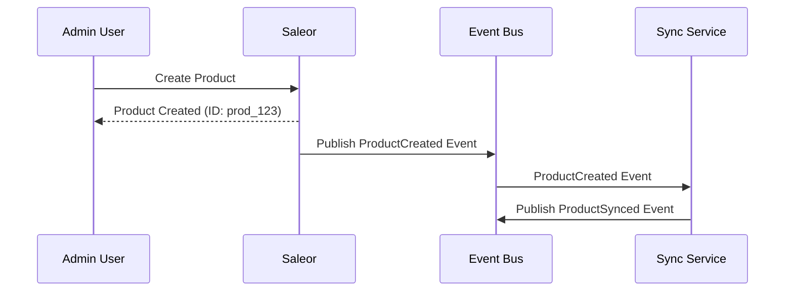
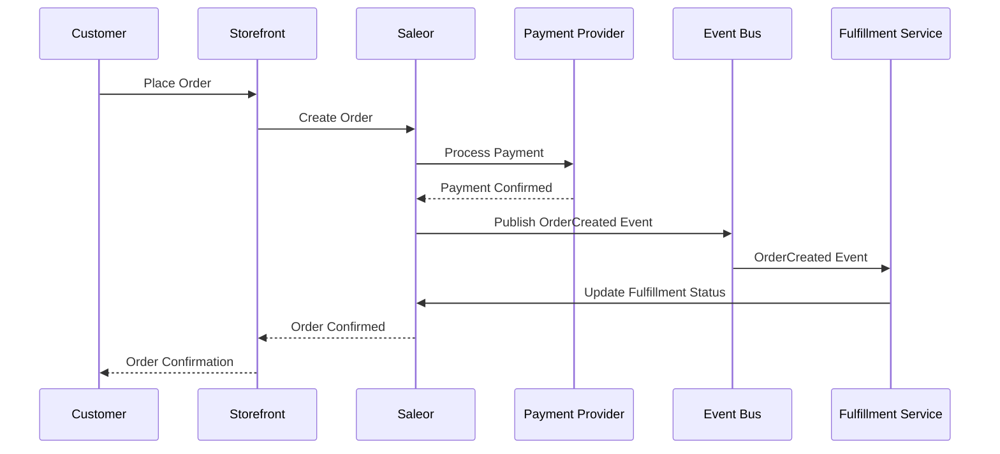
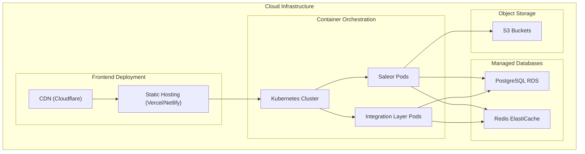

# System Architecture

This document outlines the system architecture for the migration from Statamic CMS with Simple Commerce to Saleor, with special emphasis on supporting multi-region and multi-language capabilities.

## Table of Contents

1. [Architecture Overview](#architecture-overview)
2. [Core Components](#core-components)
3. [Integration Layer](#integration-layer)
4. [Data Flow](#data-flow)
5. [Multi-Region Architecture](#multi-region-architecture)
6. [Multi-Language Support](#multi-language-support)
7. [Deployment Architecture](#deployment-architecture)
8. [Security Architecture](#security-architecture)
9. [Scalability Considerations](#scalability-considerations)

## Architecture Overview

The new system architecture is designed as a composable commerce platform using Saleor as a unified solution for both commerce functionality and content management in a headless approach. The architecture consists of the following primary components:

## Core Components

### Saleor Commerce & Content Platform

Saleor serves as the unified commerce and content platform with the following core modules:

1. **Product Catalog**
   - Manages product information, variants, options
   - Handles product relationships and categorization
   - Provides product search and filtering capabilities

2. **Pricing Engine**
   - Manages product pricing across regions and currencies
   - Handles discounts, promotions, and special pricing
   - Supports tax calculations based on regional requirements

3. **Inventory Management**
   - Tracks stock levels and inventory availability
   - Provides inventory allocation and reservation
   - Manages backorder and pre-order functionality

4. **Order Management**
   - Processes orders from creation to fulfillment
   - Manages order lifecycle and status updates
   - Handles returns, exchanges, and cancellations

5. **Customer Management**
   - Maintains customer profiles and accounts
   - Handles customer authentication and authorization
   - Manages customer addresses and preferences

6. **Payment Processing**
   - Integrates with payment providers (Stripe, PayPal, etc.)
   - Handles payment authorization and capture
   - Manages refunds and payment status

7. **Shipping Management**
   - Calculates shipping options and rates
   - Integrates with fulfillment providers
   - Manages shipping rules per region

8. **Content Management**
   - Stores rich product descriptions, features, and specifications
   - Manages product-related media assets
   - Provides localized product content across languages

9. **Media Library**
   - Centralizes storage for all media assets
   - Provides image processing and optimization
   - Manages digital assets across the platform

10. **Channel Management**
    - Manages region-specific configurations through Saleor Channels
    - Controls product availability by region
    - Configures pricing strategies per Channel

11. **Translation Management**
    - Handles multi-language content
    - Manages translations for products, categories, and pages
    - Provides translation workflows and tools

## Integration Layer

The Integration Layer ensures data consistency and synchronization across the platform:

1. **Event Bus**
   - Facilitates communication between components using an event-driven architecture
   - Implements publish-subscribe pattern for loose coupling
   - Uses message queues for reliable event delivery

2. **Data Synchronization**
   - Handles data transformation for migration purposes
   - Manages synchronization with third-party systems
   - Implements retry mechanisms and error handling

3. **Region Configuration**
   - Manages region-specific settings and configurations
   - Handles domain mapping for different regions
   - Controls language preferences per region

### Integration Layer Implementation

The integration layer is implemented using the following technologies:

## Data Flow

### Product Creation Flow

### Order Processing Flow

## Multi-Region Architecture

The multi-region architecture enables operation across different geographical regions with region-specific configurations using Saleor's Channel system:

### Domain-based Routing

The system uses domain-based routing to direct users to the appropriate regional storefront:

1. When a user accesses a domain (e.g., example.nl), the Domain Router identifies the region
2. The appropriate Saleor Channel configuration is loaded, including:
   - Currency settings
   - Language preferences
   - Tax rates and rules
   - Shipping options
   - Payment methods

### Region-specific Data

Each region (implemented as a Saleor Channel) can have specific data configurations:

1. **Product Availability**: Products can be enabled or disabled per Channel
2. **Pricing**: Different pricing strategies per Channel
3. **Shipping Methods**: Channel-specific shipping options
4. **Payment Methods**: Available payment methods by Channel
5. **Tax Rules**: Channel-specific tax calculations

## Multi-Language Support

The multi-language architecture leverages Saleor's translation capabilities to support content delivery in multiple languages based on region preferences:

### Language Detection and Selection

1. **Automatic Detection**: Based on domain, browser settings, and user preferences
2. **Manual Selection**: User can override the language via UI controls
3. **Persistence**: Selected language is stored in user preferences

### Content Localization Strategy

1. **Database-level Localization**: Content stored with language identifiers in Saleor
2. **Translation Files**: UI elements and static content stored in JSON/YAML translation files
3. **Fallback Mechanism**: If content is not available in the selected language, fall back to the default language

## Deployment Architecture

The deployment architecture leverages containerization and cloud services for scalability and reliability:

### Deployment Components

1. **Frontend Deployment**
   - Static assets served through CDN for performance
   - Jamstack approach with pre-rendered pages when possible
   - Dynamic content fetched through APIs

2. **Backend Services**
   - Containerized applications deployed on Kubernetes
   - Horizontal scaling for handling variable loads
   - Health monitoring and automatic recovery

3. **Database Layer**
   - Managed PostgreSQL instances for Saleor
   - Read replicas for performance optimization
   - Automated backups and point-in-time recovery

4. **Caching Layer**
   - Redis for application caching
   - CDN caching for static content
   - Edge caching for API responses

## Security Architecture

The security architecture implements multiple layers of protection:

### Security Components

1. **Network Security**
   - WAF to protect against common web vulnerabilities
   - DDoS protection to ensure service availability
   - SSL/TLS encryption for all communications

2. **Authentication & Authorization**
   - JWT-based authentication with short expiration
   - Role-based access control
   - OAuth integration for third-party authentication

3. **Data Security**
   - Encryption of sensitive data at rest and in transit
   - PII data protection and compliance with GDPR
   - Regular security audits and penetration testing

4. **API Security**
   - Rate limiting to prevent abuse
   - Input validation for all API endpoints
   - Proper CORS configuration to prevent unauthorized access

## Scalability Considerations

The architecture is designed with scalability in mind to handle growing demands:

### Horizontal Scaling

1. **Stateless Services**
   - All backend services designed to be stateless
   - Session data stored in Redis for shared state
   - Allows for easy horizontal scaling

2. **Database Scaling**
   - Read replicas for handling increased read traffic
   - Connection pooling for efficient resource utilization
   - Potential sharding for extremely large datasets

### Performance Optimization

1. **Caching Strategy**
   - Multi-level caching (application, CDN, browser)
   - Cache invalidation through events
   - Region-specific cache nodes for improved latency

2. **Asynchronous Processing**
   - Background processing for non-critical operations
   - Message queues for reliable task distribution
   - Scheduled jobs for maintenance tasks

### Monitoring and Elasticity

1. **Performance Monitoring**
   - Real-time metrics collection and dashboards
   - Alerting based on performance thresholds
   - Tracing for identifying bottlenecks

2. **Auto-scaling**
   - Automatic scaling based on CPU/memory utilization
   - Scheduled scaling for predictable traffic patterns
   - Burst capacity for handling traffic spikes

## Conclusion

This system architecture provides a robust foundation for migrating from Statamic CMS with Simple Commerce to Saleor. The design emphasizes:

1. Unified commerce and content management with Saleor
2. Comprehensive support for multi-region through Saleor's Channel system
3. Multi-language capabilities through Saleor's translation features
4. Scalable and secure infrastructure for future growth

The architecture allows for phased implementation, with the ability to migrate components incrementally while maintaining system integrity and performance. 