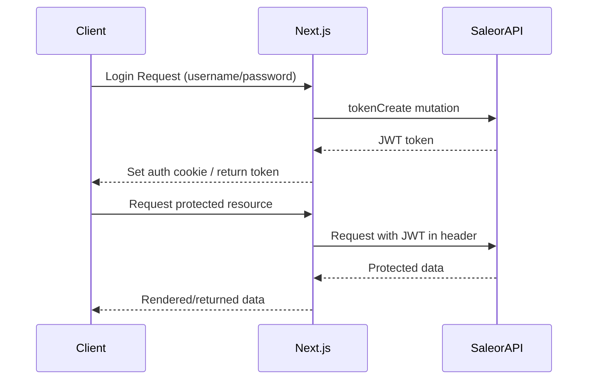

# API Specifications

This document outlines the API contracts and endpoint specifications for the Saleor migration project, focusing on integration points between components.

## GraphQL API Overview

Saleor provides a comprehensive GraphQL API that serves as the primary interface for all system interactions. Our implementation uses the following GraphQL endpoints:

| Endpoint | Purpose | Access Control |
|----------|---------|----------------|
| `/graphql/` | Main GraphQL API endpoint | JWT token required for mutations |
| `/graphql/staff/` | Staff-only operations (Dashboard) | JWT token with staff permissions |

## Authentication and Authorization

### Authentication Methods

1. **JWT-based Authentication**:
   - Token obtained via `tokenCreate` mutation
   - Refresh via `tokenRefresh` mutation
   - Required in Authorization header: `Authorization: Bearer <token>`

2. **API App Token Authentication**:
   - For server-to-server communication
   - Higher rate limits and permissions
   - Used for migration scripts and backend processes

### Authentication Flow



## Data Model Access

### Product Data API

**Key Queries**:
- `products`: List products with filtering, sorting, and pagination
- `product`: Get a single product by ID or slug

**Key Mutations**:
- `productCreate`: Create a new product
- `productUpdate`: Update an existing product
- `productDelete`: Delete a product

**Product Variant Operations**:
- `productVariantCreate`: Create product variants
- `productVariantUpdate`: Update product variants
- `productVariantDelete`: Delete product variants

### Category and Collection API

**Key Queries**:
- `categories`: List categories with filtering and pagination
- `category`: Get a single category by ID or slug
- `collections`: List collections with filtering and pagination
- `collection`: Get a single collection by ID or slug

**Key Mutations**:
- `categoryCreate`, `categoryUpdate`, `categoryDelete`
- `collectionCreate`, `collectionUpdate`, `collectionDelete`

### Multi-Channel Operations

**Channel-Specific Queries**:
- All list queries support `channel` parameter
- Example: `products(channel: "NL") { ... }`

**Channel Management**:
- `channels`: List available channels
- `channelCreate`, `channelUpdate`, `channelDelete`
- `channelActivate`, `channelDeactivate`

**Product Channel Listings**:
- `productChannelListingUpdate`: Update product availability and pricing per channel
- `productVariantChannelListingUpdate`: Update variant availability and pricing per channel

### Multi-Language Support

**Translation Queries**:
- `translations`: Get translations for a specific language
- Example: `translations(kind: PRODUCT, languageCode: NL) { ... }`

**Translation Mutations**:
- `productTranslate`: Translate product fields
- `categoryTranslate`: Translate category fields
- `attributeTranslate`: Translate attribute fields
- `pageTranslate`: Translate page fields

## Integration Patterns

### Next.js Integration

1. **Apollo Client Configuration**:
   ```typescript
   import { ApolloClient, InMemoryCache, createHttpLink } from '@apollo/client';
   import { setContext } from '@apollo/client/link/context';
   
   const httpLink = createHttpLink({
     uri: process.env.SALEOR_API_URL || 'https://your-saleor-instance.com/graphql/',
   });
   
   const authLink = setContext((_, { headers }) => {
     // Get token from cookies/localStorage/etc.
     const token = getToken();
     return {
       headers: {
         ...headers,
         authorization: token ? `Bearer ${token}` : '',
       }
     };
   });
   
   const regionLink = setContext((_, { headers }) => {
     // Get region from context
     const region = getRegion();
     return {
       headers: {
         ...headers,
         'x-region': region || 'default',
       }
     };
   });
   
   const client = new ApolloClient({
     link: authLink.concat(regionLink).concat(httpLink),
     cache: new InMemoryCache(),
   });
   ```

2. **Server-Side Rendering with Apollo**:
   ```typescript
   export async function getServerSideProps(context) {
     const client = initializeApollo();
     const { region, locale } = context;
     
     await client.query({
       query: GET_PRODUCTS,
       variables: {
         channel: region.toUpperCase(),
         languageCode: locale.toUpperCase(),
       },
     });
     
     return {
       props: {
         initialApolloState: client.cache.extract(),
       },
     };
   }
   ```

### Migration Script Integration

For migration scripts, a more direct API client is used:

```python
import requests

class SaleorClient:
    def __init__(self, api_url, email, password):
        self.api_url = api_url
        self.token = self._get_token(email, password)
    
    def _get_token(self, email, password):
        mutation = """
        mutation TokenCreate($email: String!, $password: String!) {
            tokenCreate(email: $email, password: $password) {
                token
                errors {
                    field
                    message
                }
            }
        }
        """
        response = requests.post(
            self.api_url,
            json={
                'query': mutation,
                'variables': {'email': email, 'password': password}
            }
        )
        result = response.json()
        return result['data']['tokenCreate']['token']
    
    def execute_query(self, query, variables=None):
        response = requests.post(
            self.api_url,
            json={'query': query, 'variables': variables or {}},
            headers={'Authorization': f'Bearer {self.token}'}
        )
        return response.json()
```

## Data Validation

### Input Validation Rules

All API operations enforce the following validation rules:

1. **Product Creation/Update**:
   - Name is required and 1-250 characters long
   - Slug must be unique and URL-safe
   - Price precision must match currency settings

2. **Category Creation/Update**:
   - Name is required and 1-250 characters long
   - Slug must be unique and URL-safe
   - Parent category must exist if specified

3. **Variant Creation/Update**:
   - SKU must be unique if provided
   - Price must be a valid positive number
   - Selected attributes must match product type attributes

### Error Handling

All GraphQL operations return errors in a consistent format:

```json
{
  "data": {
    "operation": {
      "success": false,
      "errors": [
        {
          "field": "name",
          "message": "This field is required",
          "code": "REQUIRED"
        }
      ]
    }
  }
}
```

## Rate Limiting and Quotas

| Operation Type | Anonymous Rate Limit | Authenticated Rate Limit | API App Rate Limit |
|----------------|----------------------|--------------------------|-------------------|
| Queries | 100/minute | 300/minute | 1000/minute |
| Mutations | 10/minute | 100/minute | 500/minute |

For migration scripts, we use API App authentication to leverage higher rate limits.

## API Versioning

The Saleor API follows semantic versioning with the following characteristics:

1. **API Stability**:
   - Breaking changes are only introduced in major version upgrades
   - Deprecation notices are provided at least one minor version before removal

2. **Versioning Headers**:
   - Use `Saleor-API-Version` header to request a specific version
   - Example: `Saleor-API-Version: 2023-01-01`

## Webhook Integration

Saleor provides webhooks for real-time event notifications:

1. **Event Subscriptions**:
   - `PRODUCT_CREATED`, `PRODUCT_UPDATED`, `PRODUCT_DELETED`
   - `ORDER_CREATED`, `ORDER_UPDATED`, `ORDER_FULFILLED`
   - `CUSTOMER_CREATED`, `CUSTOMER_UPDATED`

2. **Webhook Configuration**:
   ```graphql
   mutation {
     webhookCreate(input: {
       name: "Product Updates",
       targetUrl: "https://your-service.com/webhooks/products",
       events: [PRODUCT_UPDATED, PRODUCT_CREATED],
       isActive: true,
       secretKey: "your-secret-key"
     }) {
       webhook {
         id
       }
       errors {
         field
         message
       }
     }
   }
   ```

3. **Signature Verification**:
   ```javascript
   // In your webhook handler
   const crypto = require('crypto');
   
   function verifyWebhook(req) {
     const signature = req.headers['saleor-signature'];
     const hmac = crypto.createHmac('sha256', WEBHOOK_SECRET);
     const digest = hmac.update(JSON.stringify(req.body)).digest('hex');
     return signature === digest;
   }
   ```

## API Documentation Resources

- [Saleor API Reference](https://docs.saleor.io/docs/3.x/api-reference/) - Official Saleor API documentation
- [GraphQL API Explorer](https://docs.saleor.io/docs/3.x/developer/extending/api/introspection) - Interactive API explorer
- [JWT Authentication](https://docs.saleor.io/docs/3.x/developer/authentication) - Details on authentication mechanisms
- [Webhooks Documentation](https://docs.saleor.io/docs/3.x/developer/extending/webhooks/asynchronous-events) - Comprehensive webhook documentation 