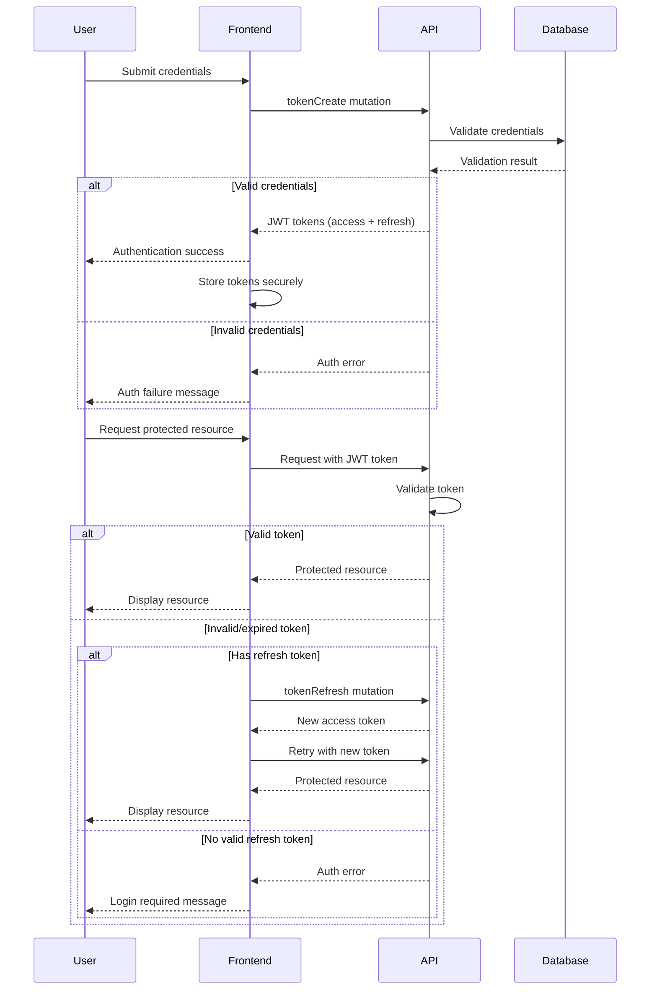

# Authentication & Security

This document outlines the authentication and security implementation for the Saleor e-commerce platform migration, covering user authentication, authorization, data protection, and security best practices.

## Authentication System

### User Authentication Methods

Our implementation uses the following authentication methods:

1. **JWT-based Authentication**
   - Primary authentication method for customers and staff
   - Tokens managed through dedicated mutations
   - Secure storage in HTTP-only cookies

2. **API Keys / Tokens**
   - Used for service-to-service communication
   - Utilized by migration scripts and automation
   - Higher permission levels and rate limits

### JWT Authentication Flow



### JWT Implementation Details

The JWT token system is implemented using:

```typescript
// Token creation (login)
const LOGIN_MUTATION = gql`
  mutation TokenCreate($email: String!, $password: String!) {
    tokenCreate(email: $email, password: $password) {
      token
      refreshToken
      csrfToken
      user {
        id
        email
      }
      errors {
        field
        message
        code
      }
    }
  }
`;

// Token refresh implementation
const REFRESH_TOKEN_MUTATION = gql`
  mutation RefreshToken($refreshToken: String!) {
    tokenRefresh(refreshToken: $refreshToken) {
      token
      errors {
        field
        message
        code
      }
    }
  }
`;

// Token verification
const VERIFY_TOKEN_MUTATION = gql`
  mutation VerifyToken($token: String!) {
    tokenVerify(token: $token) {
      isValid
      errors {
        field
        message
        code
      }
    }
  }
`;
```

### Secure Token Storage

Tokens are stored using the following security practices:

1. **Access Tokens**:
   - Stored in HTTP-only cookies
   - Marked as Secure in production
   - Protected with proper SameSite policy
   - Short expiration (15-30 minutes)

2. **Refresh Tokens**:
   - Stored in HTTP-only cookies
   - Longer expiration (7-30 days)
   - Restricted path scope
   - Rotation on use

3. **Implementation Example**:

```typescript
// Setting tokens in cookies using Next.js
import { cookies } from 'next/headers';

export function setAuthCookies(token: string, refreshToken: string) {
  const cookieOptions = {
    httpOnly: true,
    secure: process.env.NODE_ENV === 'production',
    sameSite: 'strict',
    path: '/',
  };

  cookies().set({
    name: 'auth_token',
    value: token,
    ...cookieOptions,
    maxAge: 60 * 30, // 30 minutes
  });

  cookies().set({
    name: 'refresh_token',
    value: refreshToken,
    ...cookieOptions,
    path: '/api/refresh',
    maxAge: 60 * 60 * 24 * 7, // 7 days
  });
}
```

## Authorization Model

### User Roles and Permissions

The Saleor platform implements a fine-grained permission system with the following roles:

1. **Anonymous Users**
   - Browse products and categories
   - View product details
   - Create carts
   - Begin checkout process

2. **Authenticated Customers**
   - All anonymous permissions
   - View order history
   - Manage account details
   - Save payment methods
   - Create and manage addresses

3. **Staff Users**
   - Permission-based access to admin features
   - Content management based on granted permissions
   - Order processing permissions
   - Customer support capabilities

4. **Admin Users**
   - Full system access
   - User management
   - Permission granting
   - System configuration

### Permission Checking

Permission checks are implemented at multiple levels:

1. **GraphQL API Level**:
   - Each mutation/query has permission requirements
   - JWT claims are validated against required permissions
   - Introspection is limited in production

2. **Application Level**:
   - UI elements are conditionally rendered based on permissions
   - Routes are protected using middleware
   - Form submissions validate permissions before sending requests

3. **Permission Check Implementation**:

```typescript
import { getServerSession } from 'next-auth';
import { redirect } from 'next/navigation';

export async function requireAuthentication() {
  const session = await getServerSession();
  
  if (!session) {
    redirect('/login?callbackUrl=' + encodeURIComponent(window.location.href));
  }
  
  return session;
}

export async function requirePermission(permission: string) {
  const session = await requireAuthentication();
  
  if (!session.user.permissions.includes(permission)) {
    throw new Error('Not authorized');
  }
  
  return session;
}
```

## Data Protection

### Sensitive Data Handling

The following practices are implemented to protect sensitive data:

1. **PII (Personally Identifiable Information)**:
   - Minimization principle applied across the application
   - Encrypted at rest with AES-256
   - Access restricted by permission
   - Retention policies implemented

2. **Payment Information**:
   - Never stored directly in our systems
   - Tokenized through payment processor
   - Compliance with PCI-DSS requirements
   - Transmitted only over TLS 1.2+

3. **Passwords**:
   - Stored using strong one-way hashing (Argon2id)
   - Never logged or exposed in plaintext
   - Strength requirements enforced (min length, complexity)
   - Rate-limited authentication attempts

### GDPR Compliance

The implementation includes features to support GDPR requirements:

1. **Data Subject Rights**:
   - Account data export functionality
   - Account deletion with complete data removal
   - Email preference management
   - Cookie consent management

2. **Implementation Example**:

```typescript
// User account deletion
const DELETE_ACCOUNT_MUTATION = gql`
  mutation AccountDelete {
    accountDelete {
      errors {
        field
        message
        code
      }
      user {
        id
      }
    }
  }
`;

// Data export functionality
const REQUEST_EMAIL_CHANGE_MUTATION = gql`
  mutation RequestEmailChange($newEmail: String!, $password: String!) {
    requestEmailChange(
      newEmail: $newEmail,
      password: $password,
      redirectUrl: "${process.env.NEXT_PUBLIC_DOMAIN}/account/confirm-email-change"
    ) {
      user {
        email
      }
      errors {
        field
        message
        code
      }
    }
  }
`;
```

## Security Implementations

### API Security

1. **Rate Limiting**:
   - Tiered approach based on authentication status
   - IP-based and token-based limiting
   - Configurable limits per endpoint
   - Progressive backoff for repeated violations

2. **Input Validation**:
   - Server-side validation for all inputs
   - GraphQL schema validation
   - Sanitization of user-generated content
   - Protection against injection attacks

3. **Implementation Example**:

```typescript
// API route with rate limiting
import rateLimit from 'express-rate-limit';
import slowDown from 'express-slow-down';

// Create rate limiter
const limiter = rateLimit({
  windowMs: 15 * 60 * 1000, // 15 minutes
  max: 100, // max 100 requests per windowMs
  standardHeaders: true,
  legacyHeaders: false,
  message: { error: 'Too many requests, please try again later.' },
});

// Create speed limiter (gradually slows down responses)
const speedLimiter = slowDown({
  windowMs: 15 * 60 * 1000, // 15 minutes
  delayAfter: 50, // start slowing down after 50 requests
  delayMs: 500, // add 500ms delay per request above delayAfter
});

// Apply to API routes
export { limiter, speedLimiter };
```

### Network Security

1. **TLS Configuration**:
   - Minimum TLS 1.2 requirement
   - Strong cipher suites
   - HSTS implementation
   - Certificate management with auto-renewal

2. **Content Security Policy**:
   - Strict CSP rules to prevent XSS
   - Restricted sources for scripts, styles, and media
   - frame-ancestors restrictions
   - report-uri for violation monitoring

3. **Implementation Example**:

```typescript
// next.config.js CSP configuration
const securityHeaders = [
  {
    key: 'Content-Security-Policy',
    value: `
      default-src 'self';
      script-src 'self' https://analytics.example.com 'unsafe-inline';
      style-src 'self' https://fonts.googleapis.com 'unsafe-inline';
      img-src 'self' https://media.saleor.cloud data: blob:;
      font-src 'self' https://fonts.gstatic.com;
      connect-src 'self' https://*.saleor.cloud https://api.stripe.com;
      frame-src 'self' https://js.stripe.com;
      object-src 'none';
      base-uri 'self';
      form-action 'self';
      frame-ancestors 'none';
      block-all-mixed-content;
      upgrade-insecure-requests;
    `.replace(/\s{2,}/g, ' ').trim(),
  },
  {
    key: 'X-Content-Type-Options',
    value: 'nosniff',
  },
  {
    key: 'X-Frame-Options',
    value: 'DENY',
  },
  {
    key: 'X-XSS-Protection',
    value: '1; mode=block',
  },
  {
    key: 'Referrer-Policy',
    value: 'strict-origin-when-cross-origin',
  },
  {
    key: 'Permissions-Policy',
    value: 'camera=(), microphone=(), geolocation=()',
  },
];

module.exports = {
  async headers() {
    return [
      {
        source: '/:path*',
        headers: securityHeaders,
      },
    ];
  },
};
```

### CSRF Protection

1. **Prevention Mechanisms**:
   - Double Submit Cookie pattern
   - CSRF tokens for state-changing operations
   - Origin and Referer validation
   - SameSite cookie attributes

2. **Implementation in Checkout Flow**:

```typescript
// Generate CSRF token
import { generateCsrfToken } from '@/lib/security';

// Secure form submission with CSRF protection
export function CheckoutForm() {
  const [csrfToken, setCsrfToken] = useState('');
  
  useEffect(() => {
    // Generate token on component mount
    setCsrfToken(generateCsrfToken());
  }, []);
  
  return (
    <form method="POST" action="/api/checkout/complete">
      <input type="hidden" name="csrfToken" value={csrfToken} />
      {/* Other form fields */}
      <button type="submit">Complete Checkout</button>
    </form>
  );
}

// API route with CSRF validation
export async function POST(req) {
  const { csrfToken, ...data } = await req.json();
  
  // Validate CSRF token
  if (!validateCsrfToken(req.cookies.get('csrfCookie')?.value, csrfToken)) {
    return Response.json({ error: 'Invalid CSRF token' }, { status: 403 });
  }
  
  // Process checkout
  // ...
}
```

## Multi-Region Security Considerations

For our multi-region implementation, additional security measures include:

1. **Region-Specific Access Controls**:
   - Channel-based permissions
   - Region-specific staff access
   - Appropriate data segregation

2. **Regional Compliance**:
   - GDPR for EU regions
   - CCPA for California
   - Region-specific cookie notices
   - Localized privacy policies

3. **Implementation Example**:

```typescript
// Region-aware permission check
export async function hasChannelPermission(user, channelSlug, permission) {
  // Check if user has general permission
  if (user.permissions.includes(`${permission}:*`)) {
    return true;
  }
  
  // Check if user has channel-specific permission
  return user.permissions.includes(`${permission}:${channelSlug}`);
}

// Usage in API route
export async function handler(req, res) {
  const { channelSlug } = req.query;
  const user = await getAuthenticatedUser(req);
  
  if (!user || !await hasChannelPermission(user, channelSlug, 'MANAGE_PRODUCTS')) {
    return res.status(403).json({ error: 'Not authorized for this channel' });
  }
  
  // Proceed with operation
}
```

## Security Monitoring and Incident Response

### Monitoring Implementation

The security monitoring system includes:

1. **Activity Logging**:
   - Authentication events
   - Admin actions
   - API usage patterns
   - Error conditions

2. **Anomaly Detection**:
   - Failed login attempts
   - Unusual access patterns
   - Geographic anomalies
   - Rate limit violations

3. **Implementation Example**:

```typescript
// Simplified logging middleware
import winston from 'winston';

const logger = winston.createLogger({
  level: 'info',
  format: winston.format.json(),
  defaultMeta: { service: 'saleor-storefront' },
  transports: [
    new winston.transports.File({ filename: 'error.log', level: 'error' }),
    new winston.transports.File({ filename: 'combined.log' }),
  ],
});

if (process.env.NODE_ENV !== 'production') {
  logger.add(new winston.transports.Console({
    format: winston.format.simple(),
  }));
}

export const loggerMiddleware = (req, res, next) => {
  // Log request details
  logger.info({
    type: 'request',
    method: req.method,
    path: req.path,
    ip: req.ip,
    userAgent: req.headers['user-agent'],
    userId: req.user?.id || 'anonymous',
  });
  
  // Continue processing
  next();
};
```

### Incident Response Plan

The security incident response plan includes:

1. **Detection Phase**:
   - Automated alerts
   - Manual reporting
   - Regular security reviews

2. **Response Procedures**:
   - Severity classification
   - Containment strategies
   - Investigation process
   - Communication plan

3. **Recovery Actions**:
   - Service restoration
   - Evidence preservation
   - Root cause analysis
   - Prevention measures

## Security Testing

The security testing strategy includes:

1. **Automated Testing**:
   - Regular dependency scanning
   - Static application security testing
   - Dynamic application security testing
   - API security testing

2. **Manual Reviews**:
   - Code security reviews
   - Authentication flow reviews
   - Permission model validation
   - Infrastructure security assessments

3. **Implementation in CI/CD**:

```yaml
# Example GitHub Actions workflow for security scanning
name: Security Scan

on:
  push:
    branches: [ main ]
  pull_request:
    branches: [ main ]
  schedule:
    - cron: '0 0 * * 0'  # Weekly on Sundays

jobs:
  security-scan:
    runs-on: ubuntu-latest
    steps:
      - uses: actions/checkout@v3
      
      - name: Run dependency vulnerability scan
        uses: snyk/actions/node@master
        with:
          args: --severity-threshold=high
        env:
          SNYK_TOKEN: ${{ secrets.SNYK_TOKEN }}
      
      - name: Run SAST scan
        uses: github/codeql-action/analyze@v2
        with:
          languages: javascript, typescript
      
      - name: Run OWASP ZAP scan
        uses: zaproxy/action-baseline@v0.7.0
        with:
          target: 'https://staging.example.com'
```

## Security Documentation and Training

1. **Developer Documentation**:
   - Secure coding guidelines
   - Authentication implementation guide
   - API security best practices
   - Vulnerability reporting process

2. **Admin User Training**:
   - Secure account management
   - Permission assignment best practices
   - Security incident recognition
   - Response procedures

## Related Resources

- [Saleor Authentication Documentation](https://docs.saleor.io/docs/3.x/developer/authentication)
- [OWASP Top Ten](https://owasp.org/www-project-top-ten/)
- [GDPR Compliance Checklist](https://gdpr.eu/checklist/)
- [Web Security Best Practices](https://cheatsheetseries.owasp.org/)
- [Next.js Security Documentation](https://nextjs.org/docs/authentication) 