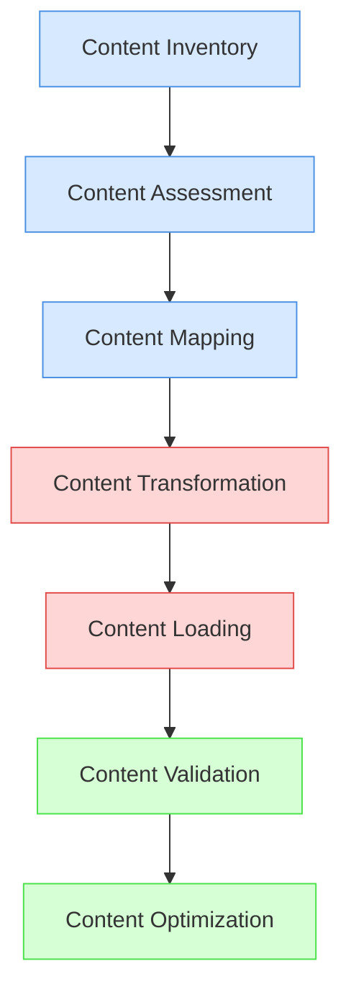
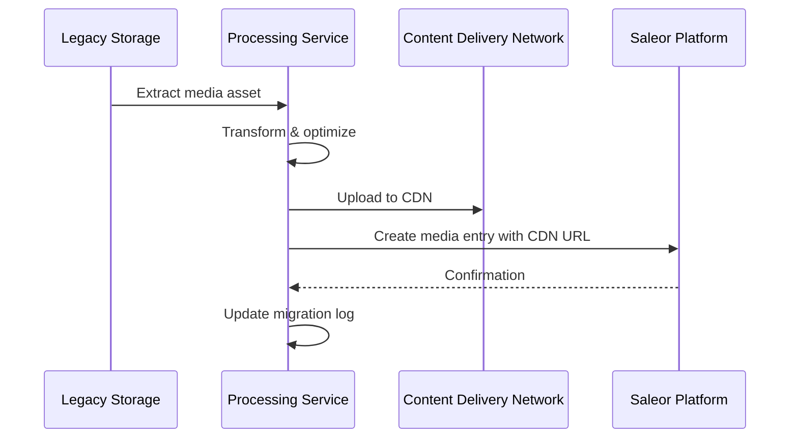
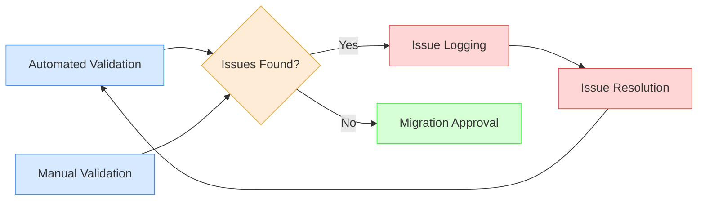

# Content Migration

This document outlines the strategy and procedures for migrating static content, media assets, and product-related content from the legacy e-commerce platform to Saleor.

## Content Types Overview

The content migration encompasses several distinct types of content:

| Content Type | Description | Migration Complexity | Priority |
|--------------|-------------|---------------------|----------|
| **Product Descriptions** | Text content describing products | Medium | High |
| **Product Images** | Product photography and graphics | High | High |
| **Category Descriptions** | Text content describing product categories | Low | Medium |
| **Static Pages** | About Us, FAQ, Terms & Conditions, etc. | Medium | Medium |
| **Blog Posts** | Articles and blog content | Medium | Low |
| **Marketing Banners** | Homepage and promotional graphics | Medium | High |
| **User-Generated Content** | Reviews, comments, Q&A | High | Medium |
| **SEO Metadata** | Meta titles, descriptions, keywords | Medium | High |
| **Rich Media** | Videos, 3D models, interactive content | High | Low |

## Content Migration Approach

The migration of content will follow a structured approach:



### 1. Content Inventory

A comprehensive inventory of all content in the legacy system will be created, including:

- Total count of each content type
- Size of media assets
- Content relationships (e.g., product images linked to products)
- Content ownership and last updated dates
- Content versions and language variants

### 2. Content Assessment

Each content item will be assessed for:

- Quality and relevance
- Completeness
- Format compatibility with Saleor
- SEO value
- Legal compliance
- Brand alignment

Based on this assessment, content will be categorized as:
- **Direct Migration**: Content that can be migrated as-is
- **Transform**: Content that requires transformation
- **Recreate**: Content that needs to be recreated
- **Archive**: Content that will not be migrated but archived
- **Discard**: Content that will not be migrated or archived

### 3. Content Mapping

Content will be mapped between the legacy system and Saleor:

- Mapping of content types
- Mapping of content relationships
- Mapping of content metadata
- Mapping of content URLs for SEO preservation

#### Product Content Mapping

| Legacy Content Field | Saleor Content Field | Transformation Required |
|----------------------|----------------------|-------------------------|
| `product_short_description` | `description` | HTML to Rich Text |
| `product_long_description` | `description_json` | HTML to JSONContent |
| `product_features` | Custom attribute | List conversion |
| `product_specifications` | Custom attributes | Key-value extraction |
| `product_meta_title` | `seo_title` | None |
| `product_meta_description` | `seo_description` | None |
| `product_keywords` | Custom attribute | Comma-separated to list |

#### Static Page Mapping

| Legacy Content Type | Saleor Implementation | Transformation Required |
|--------------------|----------------------|-------------------------|
| CMS Pages | Saleor Pages | HTML to JSONContent |
| Legal Pages | Saleor Pages | HTML to JSONContent |
| About Us | Saleor Pages | HTML to JSONContent |
| Contact Us | Saleor Pages | HTML to JSONContent |
| FAQs | Saleor Pages | HTML to JSONContent |

### 4. Content Transformation

Content transformation will be performed using specialized tools:

- **Text Content**: Scripts for converting formatting and structure
- **HTML Content**: Conversion to Saleor's rich text format
- **Images**: Resizing, format conversion, and optimization
- **Videos**: Transcoding to supported formats
- **SEO Data**: Extraction and reformatting

#### Rich Text Transformation

Legacy HTML content will be transformed to Saleor's JSONContent format using a custom transformation tool. This process includes:

1. Parsing HTML with a DOM parser
2. Converting HTML elements to corresponding JSONContent nodes
3. Handling inline formatting
4. Managing links and embedded content
5. Preserving SEO attributes

Example transformation:

```javascript
// Legacy HTML
const legacyHtml = '<p>This is a <strong>product description</strong> with a <a href="/link">link</a>.</p>';

// Transformed to Saleor JSONContent
const jsonContent = {
  "nodeType": "document",
  "data": {},
  "content": [
    {
      "nodeType": "paragraph",
      "data": {},
      "content": [
        {
          "nodeType": "text",
          "value": "This is a ",
          "marks": []
        },
        {
          "nodeType": "text",
          "value": "product description",
          "marks": [
            {
              "type": "bold"
            }
          ]
        },
        {
          "nodeType": "text",
          "value": " with a ",
          "marks": []
        },
        {
          "nodeType": "hyperlink",
          "data": {
            "uri": "/link"
          },
          "content": [
            {
              "nodeType": "text",
              "value": "link",
              "marks": []
            }
          ]
        },
        {
          "nodeType": "text",
          "value": ".",
          "marks": []
        }
      ]
    }
  ]
};
```

### 5. Content Loading

Content will be loaded into Saleor using:

- Saleor GraphQL API for text content and metadata
- Saleor Dashboard for manual content uploads (where necessary)
- Bulk upload scripts for media assets
- CDN integration for large media files

#### Media Assets Loading Process



### 6. Content Validation

Migrated content will be validated through:

- Automated checks for content integrity
- Visual inspection of key content
- SEO validation
- Cross-device display testing
- Multi-language validation

#### Validation Checklist

- [ ] Content is complete and accurate
- [ ] Images display correctly and at appropriate resolutions
- [ ] Links function correctly
- [ ] Formatting is preserved
- [ ] SEO metadata is correctly applied
- [ ] Content displays correctly on all target devices
- [ ] Content is accessible and meets WCAG standards
- [ ] Multi-language content is correctly associated

### 7. Content Optimization

Post-migration optimization will include:

- SEO refinement
- Performance optimization of media assets
- Accessibility improvements
- Content personalization setup
- Analytics implementation

## Multi-Language Content Migration

Content in multiple languages will be migrated with special consideration:

1. **Language Identification**: All content will be tagged with its language
2. **Translation Preservation**: Existing translations will be preserved
3. **Translation Relationships**: Relationships between translations will be maintained
4. **Default Language**: Default language versions will be established
5. **Translation Gaps**: Missing translations will be identified for post-migration attention

### Language Mapping

| Legacy Language Code | Saleor Language Code | Language Name |
|---------------------|----------------------|---------------|
| `en_US` | `EN` | English |
| `nl_NL` | `NL` | Dutch |
| `de_DE` | `DE` | German |
| `fr_FR` | `FR` | French |

## URL Structure Preservation

To maintain SEO value, URL structures will be preserved:

1. **URL Mapping**: Creation of a comprehensive mapping between legacy URLs and Saleor URLs
2. **Redirects**: Implementation of 301 redirects for changed URLs
3. **Canonical Tags**: Setting of canonical tags for duplicate content
4. **URL Parameters**: Handling of URL parameters and their Saleor equivalents
5. **Sitemap Updates**: Generation of new sitemaps with proper cross-referencing

### URL Structure Mapping Example

| Content Type | Legacy URL Pattern | Saleor URL Pattern |
|--------------|-------------------|-------------------|
| Product | `/product/{slug}` | `/products/{slug}` |
| Category | `/category/{slug}` | `/categories/{slug}` |
| CMS Page | `/page/{slug}` | `/pages/{slug}` |
| Blog Post | `/blog/{slug}` | `/blog/{slug}` |

## Media Asset Migration

Media assets require special handling during migration:

### Image Processing Workflow

1. **Extraction**: Images are extracted from the legacy system
2. **Analysis**: Image quality, dimensions, and format are analyzed
3. **Transformation**: Images are converted to the optimal format
4. **Resizing**: Multiple resolutions are generated for responsive design
5. **Optimization**: Images are compressed without quality loss
6. **Metadata**: EXIF and other metadata are preserved where valuable
7. **Upload**: Images are uploaded to the CDN
8. **Association**: Images are associated with the correct products in Saleor

### Video Migration Process

1. **Assessment**: Video quality and format compatibility are assessed
2. **Transcoding**: Videos are converted to web-optimized formats
3. **Thumbnails**: Video thumbnails are generated
4. **Captions**: Captions and subtitles are extracted and reformatted
5. **Hosting**: Videos are uploaded to the integrated video hosting solution
6. **Embedding**: Video embeds are created in Saleor content

## SEO Migration

SEO data migration is critical to maintain search engine rankings:

1. **Metadata Extraction**: SEO metadata is extracted from the legacy system
2. **Keyword Analysis**: Keywords are analyzed for relevance and performance
3. **Metadata Transformation**: Metadata is transformed to Saleor's format
4. **URL Mapping**: URL structures are mapped and redirects created
5. **Structured Data**: Structured data (Schema.org) is updated for Saleor
6. **Canonical Tags**: Canonical tags are established
7. **Sitemap Generation**: New sitemaps are generated
8. **Search Console Updates**: Search console properties are updated

## User-Generated Content Migration

User-generated content (UGC) requires special handling:

1. **Content Assessment**: UGC is assessed for quality and relevance
2. **Content Filtering**: Inappropriate content is filtered out
3. **Author Mapping**: Content authors are mapped to Saleor users
4. **Content Transformation**: UGC is transformed to Saleor's format
5. **Moderation Status**: Moderation statuses are preserved
6. **Privacy Compliance**: UGC is checked for privacy compliance
7. **Loading**: UGC is loaded into Saleor
8. **Notification**: Users are notified about the migration of their content (if required)

## Timeline and Phasing

The content migration will be phased according to content priority:

| Phase | Content Types | Timeline | Dependencies |
|-------|---------------|----------|--------------|
| 1 | Product data and images | Weeks 5-8 | Product data migration |
| 2 | Category content | Weeks 7-9 | Category data migration |
| 3 | Static pages | Weeks 8-10 | - |
| 4 | SEO metadata | Weeks 9-11 | Phases 1-3 completion |
| 5 | Marketing content | Weeks 10-12 | - |
| 6 | Blog and articles | Weeks 11-13 | - |
| 7 | User-generated content | Weeks 12-14 | User data migration |

## Roles and Responsibilities

| Role | Responsibilities |
|------|------------------|
| **Content Migration Lead** | Overall strategy and coordination |
| **Content Analysts** | Content assessment and mapping |
| **Technical Migration Team** | Development of migration scripts and tools |
| **SEO Specialist** | SEO preservation and optimization |
| **Media Specialist** | Media asset transformation and optimization |
| **Quality Assurance** | Content validation and testing |
| **Content Creators** | Creation of new content where needed |

## Quality Assurance Process



### Automated Validation Tests

1. **Content Completeness**: Ensuring all required content is present
2. **Image Association**: Verifying image-product associations
3. **Link Validation**: Checking for broken links
4. **Metadata Presence**: Confirming SEO metadata is present
5. **Formatting Integrity**: Verifying content formatting is preserved
6. **Multi-Language Association**: Checking language relationships

### Manual Validation Procedures

1. **Visual Inspection**: Visual review of key content
2. **Functional Testing**: Testing interactive content elements
3. **Cross-Device Testing**: Checking content on multiple devices
4. **SEO Review**: Detailed review of SEO implementation
5. **Brand Alignment**: Verification of brand standards compliance

## Risk Management

| Risk | Impact | Probability | Mitigation Strategy |
|------|--------|------------|---------------------|
| **Content Loss** | High | Low | Multiple backups, validation checks, recovery procedures |
| **Formatting Issues** | Medium | Medium | Transformation testing, format validation, manual review of key content |
| **Broken Media Links** | High | Medium | Link validation, CDN integrity checks, automated monitoring |
| **SEO Degradation** | High | Medium | URL preservation, metadata validation, search console monitoring |
| **Performance Issues** | Medium | Medium | Asset optimization, CDN implementation, performance testing |
| **Incomplete Translations** | Medium | High | Translation gap analysis, prioritized post-migration translation |

## Post-Migration Support

After the content migration, the following support will be provided:

1. **Content Issues Resolution**: Rapid response team for content issues
2. **Content Updates**: Support for content updates during transition
3. **SEO Monitoring**: Ongoing monitoring of search performance
4. **Performance Optimization**: Continuous optimization of content delivery
5. **Content Training**: Training for content managers on Saleor's content capabilities

## Related Documents

- [Migration Strategy](/docs/migration/migration-strategy.md)
- [Data Mapping](/docs/migration/data-mapping.md)
- [Testing and Validation](/docs/migration/testing-validation.md)
- [Multi-Language Strategy](/docs/guides/internationalization.md) 