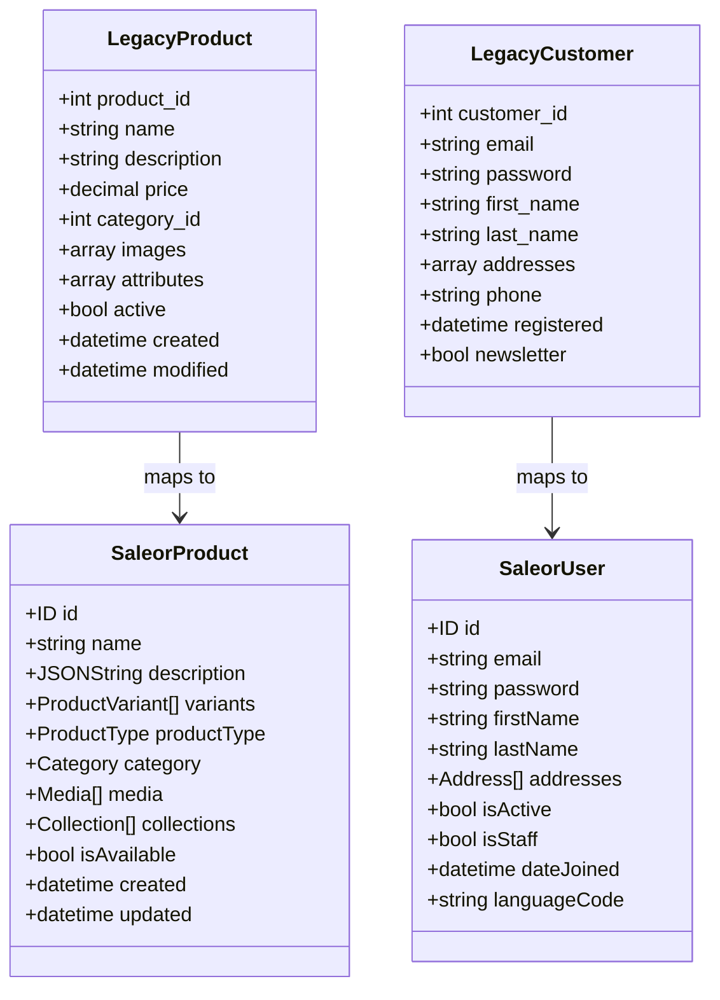

# Data Mapping

This document provides detailed mapping between the legacy e-commerce platform data model and Saleor's data model, serving as the definitive reference for all data migration activities.

## Overview

Successful data migration requires precise mapping between source and target data structures. This document defines how each data entity in the legacy system maps to its corresponding entity in Saleor, including field-level mapping, data transformations, and special handling requirements.

## Data Model Comparison



## Product Mapping

### Core Product Fields

| Legacy Field | Saleor Field | Transformation Required | Notes |
|-------------|--------------|-------------------------|-------|
| `product_id` | `id` | Yes | Legacy IDs will be stored as metadata for reference |
| `name` | `name` | No | Direct mapping |
| `description` | `description` | Yes | Convert HTML to JSONContent format |
| `price` | `variants[0].pricing.price.net` | Yes | Map to default variant price |
| `category_id` | `category` | Yes | Map to Saleor category ID based on category mapping |
| `active` | `isAvailable` | No | Direct mapping |
| `created` | `created` | No | Direct mapping |
| `modified` | `updated` | No | Direct mapping |

### Product Images

Images require special handling:

| Legacy Field | Saleor Field | Transformation Required | Notes |
|-------------|--------------|-------------------------|-------|
| `images[].url` | `media[].url` | Yes | Images need to be downloaded and uploaded to Saleor's media storage |
| `images[].alt` | `media[].alt` | No | Direct mapping |
| `images[].position` | `media[].sortOrder` | No | Direct mapping |

### Product Variants

In the legacy system, variants are stored in a separate table with a relation to the main product. In Saleor, they are part of the product structure.

| Legacy Field | Saleor Field | Transformation Required | Notes |
|-------------|--------------|-------------------------|-------|
| `variant_id` | `variants[].id` | Yes | Legacy IDs will be stored as metadata for reference |
| `sku` | `variants[].sku` | No | Direct mapping |
| `price` | `variants[].pricing.price.net` | Yes | Currency conversion may be required |
| `stock_quantity` | `variants[].stocks[].quantity` | Yes | Map to warehouse stock entry |
| `weight` | `variants[].weight` | Yes | Convert units if necessary |
| `dimensions` | `variants[].dimensions` | Yes | Split into height, width, length |

### Product Attributes

Products in the legacy system have attributes stored in a key-value format. These need to be mapped to Saleor's attribute system.

| Legacy Field | Saleor Field | Transformation Required | Notes |
|-------------|--------------|-------------------------|-------|
| `attributes[].name` | `attributes[].attribute.name` | Yes | Create attributes in Saleor first |
| `attributes[].value` | `attributes[].values` | Yes | Create attribute values in Saleor |

Example transformation for a color attribute:

```javascript
// Legacy format
{
  "name": "color",
  "value": "Red"
}

// Saleor format (via GraphQL)
{
  "attribute": {
    "id": "QXR0cmlidXRlOjE="  // ID of the color attribute
  },
  "values": [
    {
      "id": "QXR0cmlidXRlVmFsdWU6MQ=="  // ID of the "Red" value
    }
  ]
}
```

## Customer Mapping

### Core Customer Fields

| Legacy Field | Saleor Field | Transformation Required | Notes |
|-------------|--------------|-------------------------|-------|
| `customer_id` | `id` | Yes | Legacy IDs will be stored as metadata for reference |
| `email` | `email` | No | Direct mapping |
| `password` | `password` | Yes | Passwords need to be rehashed using Saleor's mechanism |
| `first_name` | `firstName` | No | Direct mapping |
| `last_name` | `lastName` | No | Direct mapping |
| `phone` | `metadata["phone"]` | Yes | Store in metadata as Saleor has no default phone field |
| `registered` | `dateJoined` | No | Direct mapping |
| `newsletter` | `metadata["newsletter"]` | Yes | Store in metadata as Saleor has no newsletter field |

### Customer Addresses

| Legacy Field | Saleor Field | Transformation Required | Notes |
|-------------|--------------|-------------------------|-------|
| `addresses[].address1` | `addresses[].streetAddress1` | No | Direct mapping |
| `addresses[].address2` | `addresses[].streetAddress2` | No | Direct mapping |
| `addresses[].city` | `addresses[].city` | No | Direct mapping |
| `addresses[].state` | `addresses[].countryArea` | No | Direct mapping |
| `addresses[].zip` | `addresses[].postalCode` | No | Direct mapping |
| `addresses[].country` | `addresses[].country` | Yes | Convert country code to Saleor format |
| `addresses[].is_default` | `addresses[].isDefaultShippingAddress` and `addresses[].isDefaultBillingAddress` | Yes | Map to both address types |

## Order Mapping

### Core Order Fields

| Legacy Field | Saleor Field | Transformation Required | Notes |
|-------------|--------------|-------------------------|-------|
| `order_id` | `id` | Yes | Legacy IDs will be stored as metadata for reference |
| `customer_id` | `user` | Yes | Map to Saleor user ID |
| `order_status` | `status` | Yes | Map legacy status values to Saleor statuses |
| `payment_status` | `payments[].status` | Yes | Map legacy payment status to Saleor payment status |
| `shipping_method` | `shippingMethod` | Yes | Map to Saleor shipping method |
| `shipping_cost` | `shippingPrice.gross` | No | Direct mapping |
| `total` | `total.gross` | No | Direct mapping |
| `created_at` | `created` | No | Direct mapping |
| `updated_at` | `updated` | No | Direct mapping |

### Order Items

| Legacy Field | Saleor Field | Transformation Required | Notes |
|-------------|--------------|-------------------------|-------|
| `items[].product_id` | `lines[].variant.product.id` | Yes | Map to Saleor product ID |
| `items[].variant_id` | `lines[].variant.id` | Yes | Map to Saleor variant ID |
| `items[].quantity` | `lines[].quantity` | No | Direct mapping |
| `items[].price` | `lines[].unitPrice.gross` | No | Direct mapping |
| `items[].total` | - | Yes | Calculated field in Saleor |

### Order Status Mapping

| Legacy Status | Saleor Status | Notes |
|--------------|--------------|-------|
| `pending` | `UNFULFILLED` | Initial order state |
| `processing` | `PARTIALLY_FULFILLED` | Order being processed |
| `shipped` | `FULFILLED` | Order has been shipped |
| `delivered` | `FULFILLED` | No direct equivalent, use metadata |
| `cancelled` | `CANCELED` | Order cancelled |
| `refunded` | `RETURNED` | Order returned and refunded |

## Category Mapping

| Legacy Field | Saleor Field | Transformation Required | Notes |
|-------------|--------------|-------------------------|-------|
| `category_id` | `id` | Yes | Legacy IDs will be stored as metadata for reference |
| `name` | `name` | No | Direct mapping |
| `description` | `description` | Yes | Convert HTML to JSONContent format |
| `parent_id` | `parent` | Yes | Map to Saleor parent category ID |
| `image` | `backgroundImage` | Yes | Upload image to Saleor media storage |
| `active` | `isVisible` | No | Direct mapping |
| `position` | `metadata["position"]` | Yes | Store in metadata |

## Collection Mapping

| Legacy Field | Saleor Field | Transformation Required | Notes |
|-------------|--------------|-------------------------|-------|
| `collection_id` | `id` | Yes | Legacy IDs will be stored as metadata for reference |
| `name` | `name` | No | Direct mapping |
| `description` | `description` | Yes | Convert HTML to JSONContent format |
| `image` | `backgroundImage` | Yes | Upload image to Saleor media storage |
| `active` | `isVisible` | No | Direct mapping |
| `products` | `products` | Yes | Map to Saleor product IDs |

## Special Data Handling

### Multi-language Content

For multi-language content, the following approach will be used:

1. The primary language (English) will be migrated first
2. For each translated field in the legacy system, a corresponding translation will be created in Saleor
3. Translations will be stored using Saleor's translation model

Example for product name translations:

```javascript
// Legacy format
{
  "product_id": 123,
  "name": "Blue T-Shirt",
  "translations": {
    "nl": {
      "name": "Blauw T-shirt"
    },
    "de": {
      "name": "Blaues T-Shirt"
    },
    "fr": {
      "name": "T-shirt bleu"
    }
  }
}

// Saleor format (via GraphQL)
mutation {
  productTranslate(
    id: "UHJvZHVjdDoxMjM=",
    languageCode: NL,
    input: {
      name: "Blauw T-shirt"
    }
  ) {
    product {
      id
    }
  }
}
```

### Rich Text Content

Rich text content in the legacy system (HTML format) will be converted to Saleor's JSONContent format:

```javascript
// Example transformation function
function htmlToJSONContent(html) {
  // Use a library like turndown to convert HTML to Markdown
  const markdown = turndown.turndown(html);
  
  // Convert Markdown to JSONContent format
  return {
    blocks: [
      {
        type: "paragraph",
        data: {
          text: markdown
        }
      }
    ],
    entityMap: {}
  };
}
```

### Product Metadata

Additional product data in the legacy system that doesn't have a direct mapping in Saleor will be stored as metadata:

```javascript
// Example metadata structure
{
  "legacy_id": "123",
  "custom_field_1": "Value 1",
  "custom_field_2": "Value 2",
  "legacy_url": "/products/blue-t-shirt"
}
```

## Database Scripts

### Sample Product Migration Script

```javascript
async function migrateProducts() {
  const legacyProducts = await fetchLegacyProducts();
  
  for (const legacyProduct of legacyProducts) {
    // 1. Create product type if needed
    const productType = await getOrCreateProductType(legacyProduct.type);
    
    // 2. Find category
    const category = await mapCategory(legacyProduct.category_id);
    
    // 3. Transform description to JSONContent
    const description = htmlToJSONContent(legacyProduct.description);
    
    // 4. Create the product
    const product = await createSaleorProduct({
      name: legacyProduct.name,
      description: description,
      productType: productType.id,
      category: category.id,
      isAvailable: legacyProduct.active,
      metadata: {
        legacy_id: legacyProduct.product_id.toString(),
        legacy_url: legacyProduct.url
      }
    });
    
    // 5. Add variants
    await migrateProductVariants(legacyProduct, product.id);
    
    // 6. Add images
    await migrateProductImages(legacyProduct, product.id);
    
    // 7. Add translations
    await migrateProductTranslations(legacyProduct, product.id);
    
    console.log(`Migrated product ${legacyProduct.product_id} to ${product.id}`);
  }
}
```

## Validation Rules

To ensure data integrity, the following validation rules will be applied during migration:

### Product Validation

1. Every product must have at least one variant
2. Product names must not be empty
3. SKUs must be unique across all variants
4. Required attributes must have values

### Customer Validation

1. Email addresses must be valid and unique
2. Addresses must have required fields (street, city, postal code, country)

### Order Validation

1. Each order must have a valid customer
2. Order items must reference valid products
3. Order totals must match the sum of item totals plus shipping

## Incremental Migration Support

For incremental migration during parallel operation, each entity will track the last updated timestamp to determine which records need migration in subsequent runs.

```javascript
async function incrementalMigration(entityType, lastRunTimestamp) {
  const updatedRecords = await fetchLegacyUpdatedRecords(
    entityType, 
    lastRunTimestamp
  );
  
  for (const record of updatedRecords) {
    await migrateRecord(entityType, record);
  }
  
  return new Date(); // Return current timestamp for next run
}
```

## Multi-Region Considerations

For multi-region support, the following approach will be used:

1. Products will be created once in Saleor
2. Channel availability and pricing will be configured for each region
3. Region-specific data will be stored as metadata where needed

```javascript
// Example of multi-region pricing migration
async function migrateProductPricing(legacyProduct, saleorProductId) {
  for (const region of regions) {
    const legacyRegionPrice = legacyProduct.regional_prices[region];
    
    if (legacyRegionPrice) {
      await createChannelListing({
        productId: saleorProductId,
        channelId: regionToChannelMap[region],
        isAvailable: true,
        visibleInListings: true,
        price: legacyRegionPrice.amount,
        currency: legacyRegionPrice.currency
      });
    }
  }
}
```

## Related Documents

- [Migration Strategy](/docs/migration/migration-strategy.md)
- [Content Migration](/docs/migration/content-migration.md)
- [Testing and Validation](/docs/migration/testing-validation.md)