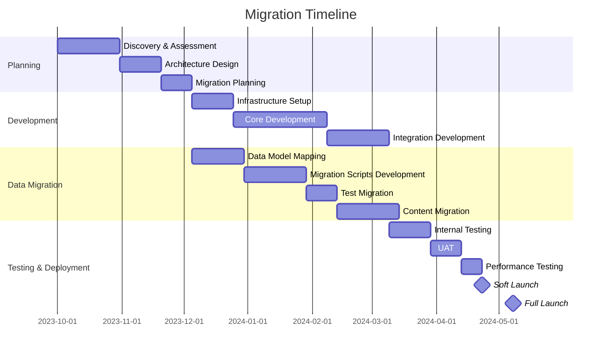
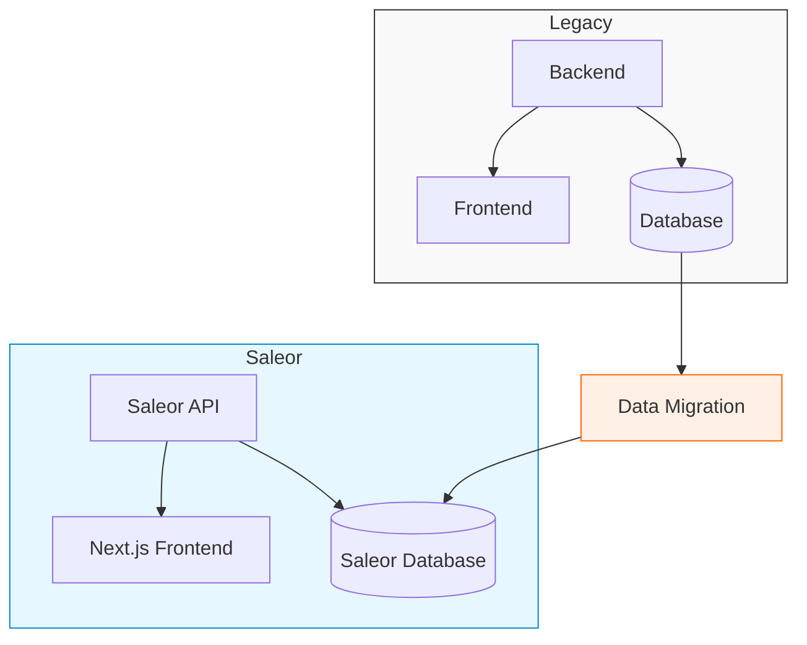
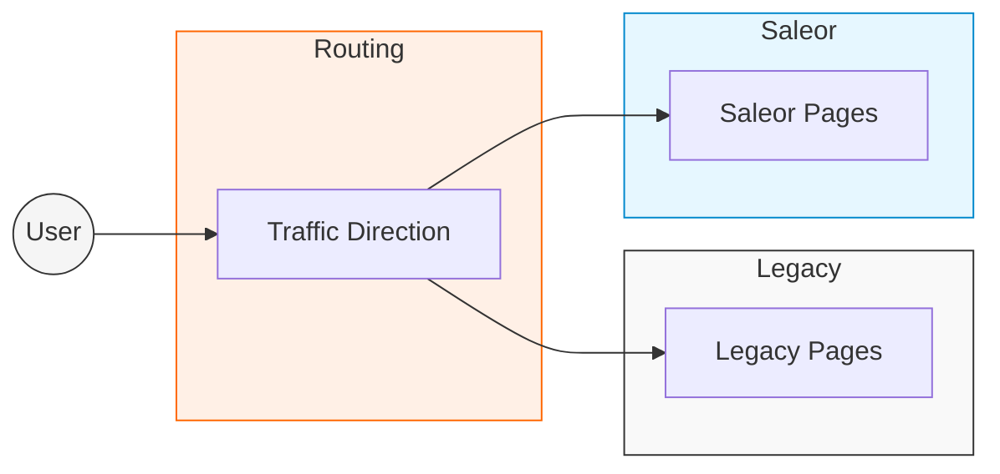

# Migration Strategy

This document outlines the comprehensive strategy for migrating from the legacy e-commerce platform to Saleor.

## Executive Summary

The migration to Saleor aims to modernize our e-commerce infrastructure, improve performance, enhance customer experience, and enable faster feature development. This strategy document provides a framework for planning and executing the migration with minimal disruption to business operations and customer experience.

## Migration Goals

| Goal | Description | Success Criteria |
|------|-------------|------------------|
| **Technical Modernization** | Update the underlying technology stack | Implementation of a headless architecture with Saleor GraphQL API and Next.js frontend |
| **Performance Improvement** | Enhance site speed and reliability | 30% improvement in page load times and 99.9% uptime |
| **Feature Enhancement** | Enable new e-commerce capabilities | Implementation of multi-region support, improved product discovery, and enhanced checkout |
| **Scalability** | Support business growth | System capable of handling 3x current traffic levels |
| **Maintenance Reduction** | Reduce technical debt and maintenance burden | 40% reduction in maintenance time and costs |
| **Multi-language Support** | Enhance internationalization capabilities | Support for EN, NL, DE, and FR with improved translation workflow |

## Migration Approach

The migration will follow a phased approach to minimize risk and disruption:

### Migration Phases

#### Phase 1: Discovery & Planning
- Comprehensive assessment of existing system
- Requirements gathering for new system
- Architecture design and technology selection
- Detailed migration planning and timeline development

#### Phase 2: Infrastructure Setup
- Saleor instance setup and configuration
- Next.js application setup
- CI/CD pipeline establishment
- Environments configuration (dev, test, staging, production)
- Cloud infrastructure setup

#### Phase 3: Core Development
- Development of key Saleor customizations
- Next.js storefront core implementation
- Authentication integration
- Payment gateway integration
- Shipping integration

#### Phase 4: Data Migration
- Data model mapping
- Migration scripts development
- Test migrations
- Content and media migration

#### Phase 5: Testing & Validation
- Comprehensive testing
- Performance testing
- User acceptance testing
- SEO validation

#### Phase 6: Deployment
- Soft launch with limited traffic
- Monitoring and issue resolution
- Full cutover
- Post-launch support

## Migration Strategies

### 1. Parallel Development Strategy

The new Saleor system will be developed in parallel with the legacy system:

This approach allows:
- Independent development of the new system
- Thorough testing before cutover
- Minimal disruption to the existing system
- Ability to roll back if critical issues arise

### 2. Phased Feature Migration

Features will be migrated in priority order:

1. Core e-commerce functionality (product catalog, search, cart, checkout)
2. Customer accounts and order history
3. Content and marketing features
4. Advanced features (recommendations, personalization)

### 3. Hybrid Transition Period

During the transition, a hybrid approach may be employed:

This allows:
- Gradual migration of traffic
- Testing with real users
- Feature-by-feature migration
- Immediate rollback capability

## Data Migration Strategy

The data migration will follow these key principles:

### 1. Data Mapping

Comprehensive mapping between legacy data models and Saleor models.

### 2. Data Transformation

Custom scripts will transform data from legacy formats to Saleor formats.

### 3. Data Validation

Rigorous validation procedures to ensure data integrity.

### 4. Migration Sequence

Data will be migrated in a specific sequence to maintain referential integrity:

1. Products and Categories
2. Customer Data
3. Order History
4. Reviews and UGC
5. Content and Media

### 5. Incremental Migration

Where possible, data will be migrated incrementally to reduce risk and allow for validation.

## Risk Management

| Risk | Impact | Probability | Mitigation Strategy |
|------|--------|------------|---------------------|
| **Data Loss or Corruption** | Critical | Low | Multiple backups, thorough testing, validation procedures |
| **Extended Downtime** | High | Low | Parallel operation, phased cutover, thorough testing |
| **Performance Issues** | High | Medium | Performance testing, scalability planning, infrastructure optimization |
| **Feature Parity Gaps** | Medium | Medium | Comprehensive requirements gathering, priority-based development |
| **Integration Failures** | High | Medium | Early integration testing, fallback mechanisms |
| **User Adoption Issues** | Medium | Low | Training, clear communication, UX focus in development |
| **SEO Impact** | High | Medium | URL preservation, redirects, SEO monitoring |

## Technical Delivery Approach

The technical implementation will follow these principles:

### 1. API-First Development

- Saleor GraphQL API as the foundation
- Clear API contracts between frontend and backend
- Comprehensive API testing

### 2. Component-Based Frontend

- Reusable React components
- Clear separation of concerns
- Comprehensive component testing

### 3. Continuous Integration & Deployment

- Automated testing on each commit
- Automated deployment pipelines
- Environment parity

### 4. Feature Flags

- Ability to enable/disable features
- A/B testing capabilities
- Gradual feature rollout

## Resource Requirements

| Resource Type | Quantity | Role |
|---------------|----------|------|
| **Project Manager** | 1 | Overall project coordination |
| **Technical Architect** | 1 | System design and technical decisions |
| **Backend Developers** | 2-3 | Saleor customization and API development |
| **Frontend Developers** | 3-4 | Next.js storefront development |
| **Data Migration Specialist** | 1-2 | Data mapping and migration scripts |
| **QA Engineers** | 2 | Testing and quality assurance |
| **DevOps Engineer** | 1 | Infrastructure and deployment |
| **SEO Specialist** | 1 | SEO preservation and optimization |
| **UX Designer** | 1 | User experience design |

## Timeline and Milestones

| Milestone | Target Date | Deliverables |
|-----------|-------------|--------------|
| **Project Kickoff** | Week 1 | Project plan, team assignments |
| **Discovery Complete** | Week 4 | Requirements document, architecture design |
| **Infrastructure Setup** | Week 8 | Development, test, and production environments |
| **Core Development Complete** | Week 20 | Basic storefront functionality, admin capabilities |
| **Data Migration Complete** | Week 24 | Migrated products, customers, orders |
| **Content Migration Complete** | Week 28 | Migrated content, media assets |
| **Testing Complete** | Week 32 | Test reports, issue resolution |
| **Soft Launch** | Week 34 | Limited production deployment |
| **Full Launch** | Week 38 | Complete production deployment |
| **Post-Launch Support** | Weeks 38-50 | Monitoring, optimization, issue resolution |

## Communication Plan

### Stakeholder Communication

| Stakeholder Group | Communication Method | Frequency |
|-------------------|----------------------|-----------|
| **Executive Team** | Status report, executive summary | Bi-weekly |
| **Department Heads** | Detailed status report, milestone review | Weekly |
| **Development Team** | Daily standup, sprint planning/review | Daily/Bi-weekly |
| **Operations Team** | Operational readiness updates | Weekly |
| **Marketing Team** | Feature/timeline updates | Bi-weekly |
| **Customer Service** | Training, feature updates | As needed |
| **Customers** | Announcements, preview access | Key milestones |

### Communication Tools

- Project management system for task tracking
- Documentation repository for technical documentation
- Regular status meetings
- Issue tracking system
- Email updates for formal communications

## Success Criteria

The migration will be considered successful when:

1. **Functional Completion**: All required features are implemented
2. **Data Integrity**: All data is successfully migrated and validated
3. **Performance**: The new system meets or exceeds performance targets
4. **User Adoption**: Internal users are trained and using the system successfully
5. **Business Continuity**: No significant disruption to business operations
6. **Technical Quality**: Code quality and architecture meet defined standards
7. **Operational Readiness**: Support and maintenance procedures are in place

## Post-Launch Support

After launch, a dedicated support period will include:

- **Hypercare**: Immediate issue resolution for critical issues
- **Performance Monitoring**: Ongoing monitoring and optimization
- **Feature Refinement**: Addressing user feedback
- **Knowledge Transfer**: Ensuring team capability for ongoing support
- **Documentation**: Finalizing system documentation

## Related Documents

- [Data Mapping](/docs/migration/data-mapping.md)
- [Content Migration](/docs/migration/content-migration.md)
- [Testing and Validation](/docs/migration/testing-validation.md)
- [Technical Architecture](/docs/architecture/overview.md) 