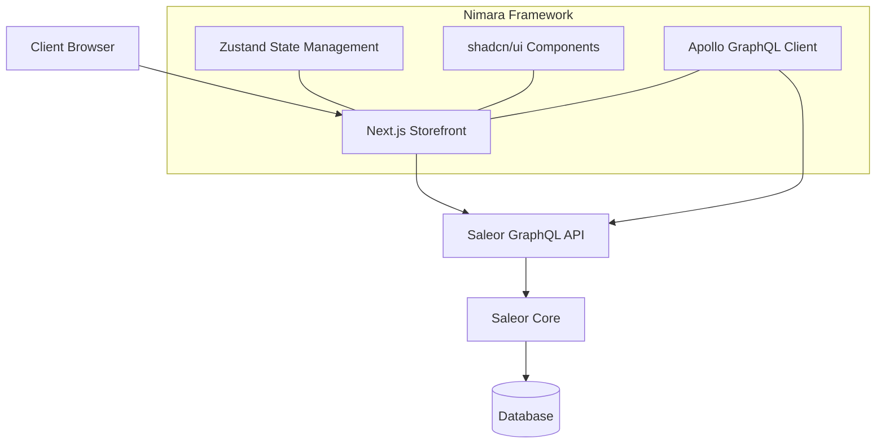
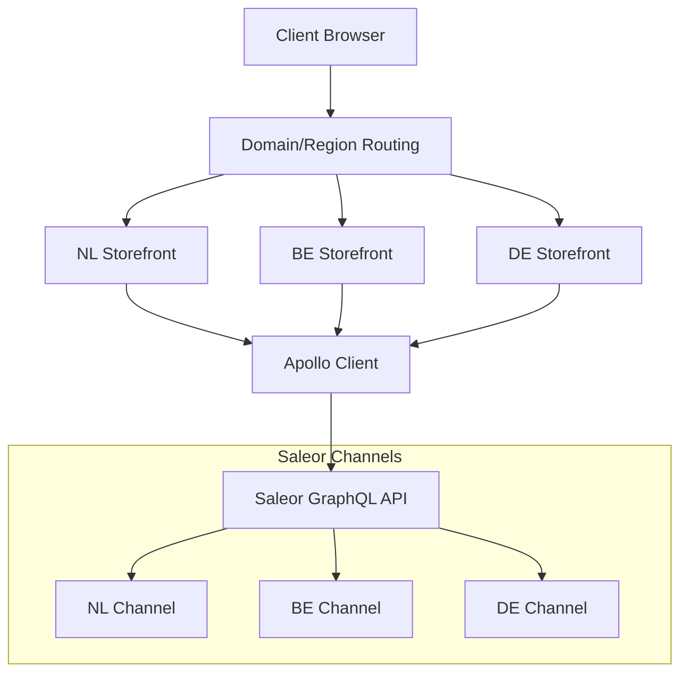
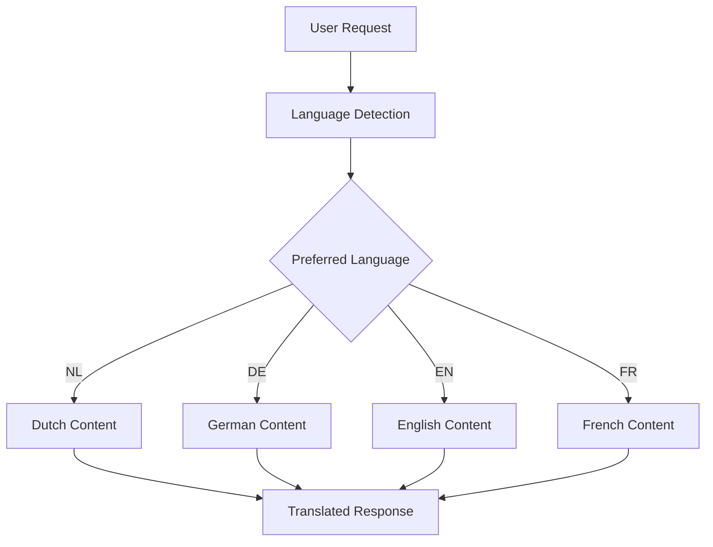
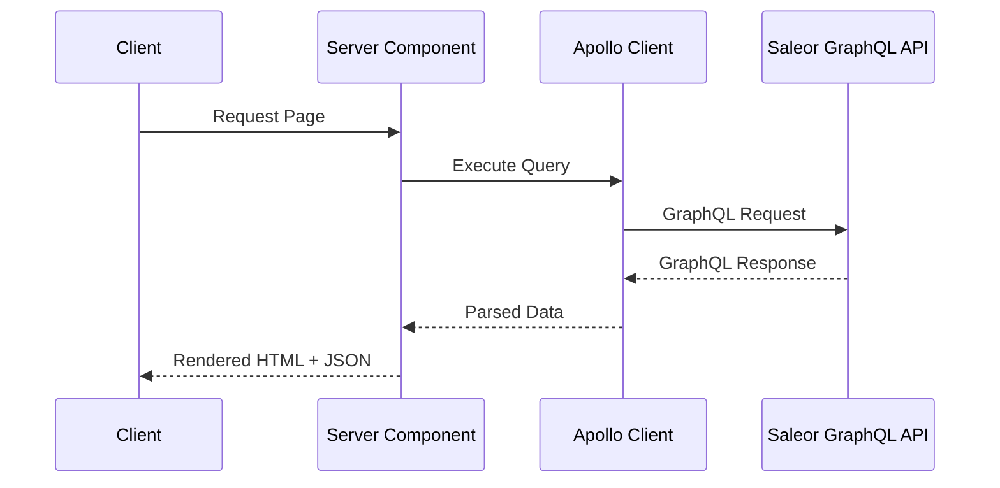
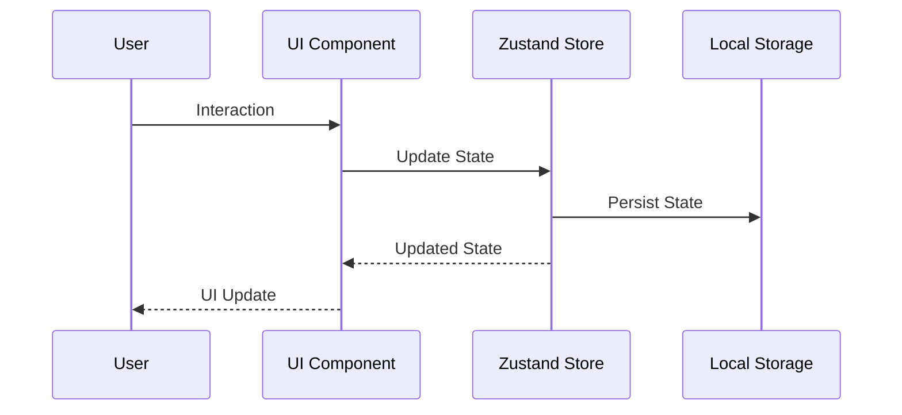

# System Patterns: Nimara-based Architecture

## Architecture Overview

Our system architecture is based on the Nimara e-commerce framework, a production-ready storefront designed specifically for Saleor. The architecture follows modern best practices with a clear separation of concerns:



## Key Architectural Patterns

### Monorepo Structure (Turborepo)
Nimara uses a monorepo architecture with Turborepo, providing:
- Clear separation between packages
- Shared configuration and utilities
- Optimized build process
- Consistent tooling

### Multi-Region Implementation
We've extended Nimara's architecture to support multiple regions through Saleor's Channel system:



- Region detection based on domain
- Channel-specific GraphQL queries
- Region-specific configuration (pricing, tax, shipping)
- Shared component base with region-specific overrides

### Multi-Language Support
Language handling is implemented with:



- Language detection from URL path segments
- Language code passed to Saleor GraphQL queries
- Client-side language switching
- Server-side rendering with language context

### State Management
Zustand for client-side state management:
- Cart state with localStorage persistence
- User preferences and settings
- UI state (modals, drawers, navigation)

### UI Component Architecture
Leveraging shadcn/ui components:
- Accessible by default
- Themeable with Tailwind CSS
- Consistent design language
- Reusable across the application

### Server/Client Component Pattern
Next.js App Router with:
- Server Components for data fetching
- Client Components for interactivity
- Hybrid approach for optimal performance

## Technology Stack

| Layer | Technology | Purpose |
|-------|------------|---------|
| Frontend | Next.js 14 | React framework with App Router |
| UI | shadcn/ui + Tailwind CSS | Component library and styling |
| State Management | Zustand | Client-side state with persistence |
| API Client | Apollo Client | GraphQL data fetching |
| Backend | Saleor | Headless e-commerce platform |
| Build System | Turborepo | Monorepo management |
| Testing | Playwright | End-to-end testing |

## Code Organization
Nimara follows a well-structured monorepo pattern:
```
nimara-ecommerce/
├── apps/
│   ├── docs/ - Documentation site
│   └── storefront/ - Next.js storefront
├── packages/
│   ├── ui/ - UI components
│   ├── config/ - Shared configuration
│   └── tsconfig/ - TypeScript configuration
```

Within the storefront:
```
storefront/
├── app/ - Next.js App Router pages
├── components/ - UI components
├── lib/ - Utility functions and shared code
│   ├── graphql/ - GraphQL queries and types
│   └── stores/ - Zustand state stores
└── public/ - Static assets
```

## Data Flow Patterns

### GraphQL Data Fetching


### Client-Side State Management


## Extension Points
The architecture is designed for extensibility:
- Custom hooks for business logic
- Component composition for UI customization
- Middleware for API request/response transformation
- Plugin system for core functionality extensions