# System Patterns: Statamic to Medusa.js Migration

## System Architecture

The migration will implement a modern, decoupled architecture with clear separation of concerns:

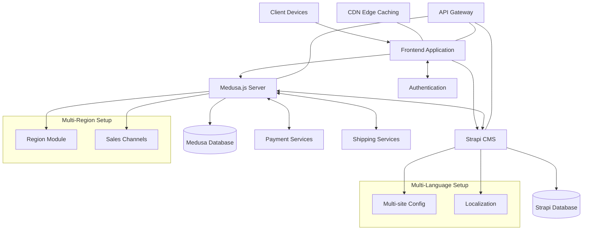

### Key Components

1. **Frontend Application**
   - React-based SPA or Next.js for SSR capabilities
   - Responsive design for all device types
   - Component-based architecture for reusability
   - State management using React Context or Redux
   - Multiple storefront applications (one per domain)
   - Language switching interface
   - i18n integration for localization
   - Edge caching for region-specific performance optimization

2. **Medusa.js Backend**
   - Core commerce functionality
   - RESTful API for product, cart, and order operations
   - Plugin-based architecture for extensibility
   - Event-driven system for handling complex workflows
   - Region Module for multi-region support
   - Sales Channels for managing product availability per store
   - Currency and payment method configuration per region
   - Single instance approach with region module (rather than multi-store)

3. **Strapi CMS**
   - Content management system
   - Custom content types for various page structures
   - Role-based access control
   - API-first design for content delivery
   - Multi-site capability for domain-specific content
   - Localization support for multiple languages
   - Content workflows for managing translations
   - Dedicated translation workflow for maintaining content across languages

4. **Databases**
   - PostgreSQL for both Medusa.js and Strapi
   - Separate databases for commerce and content concerns
   - Optimized schema design for performance
   - Support for storing localized content

5. **Integration Services**
   - Authentication and authorization
   - Payment processing
   - Shipping and fulfillment
   - Search functionality
   - Region and language detection
   - URL structure management

## Design Patterns

### API Design
- **RESTful principles**: Clear resource naming and appropriate HTTP methods
- **GraphQL (optional)**: For more flexible data querying when needed
- **Versioning**: API versioning to facilitate future changes
- **Pagination**: Consistent pagination across all list endpoints
- **Filtering**: Standardized query parameter format for filtering
- **Localization**: Support for language and region parameters in API requests

### Data Modeling
- **Domain-Driven Design**: Organizing code around business domains
- **Entity Relationships**: Clear modeling of relationships between products, categories, customers, orders, etc.
- **Content Modeling**: Flexible content structures in Strapi that can evolve over time
- **Localization Modeling**: Storing and retrieving content in multiple languages
- **Region-Specific Data**: Modeling data that varies by region (prices, availability, etc.)

### State Management
- **Client-Side**: React Context or Redux for UI state
- **Server-Side**: Event-driven architecture for complex workflows
- **Cache Management**: Strategic caching at various levels (CDN, API, database)
- **Region and Language State**: Managing and persisting user's region and language preferences

### Security Patterns
- **JWT Authentication**: For secure API access
- **Role-Based Access Control**: For admin functionality
- **Data Validation**: Input validation at all entry points
- **CSRF Protection**: For form submissions
- **Rate Limiting**: To prevent abuse
- **Region-Specific Permissions**: Access control based on regions

### Performance Patterns
- **Code Splitting**: Load only what's needed
- **Lazy Loading**: For images and non-critical components
- **Server-Side Rendering**: For SEO and initial load performance
- **Connection Pooling**: For database efficiency
- **Caching Strategy**: Multi-level caching for frequently accessed data
- **Region-Based Routing**: Optimizing request routing based on user region

## Component Relationships

### Product Management Flow
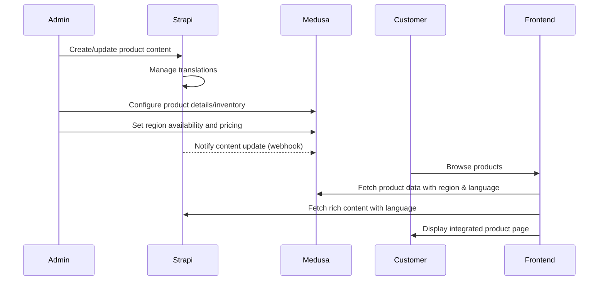

### Region and Language Selection Flow
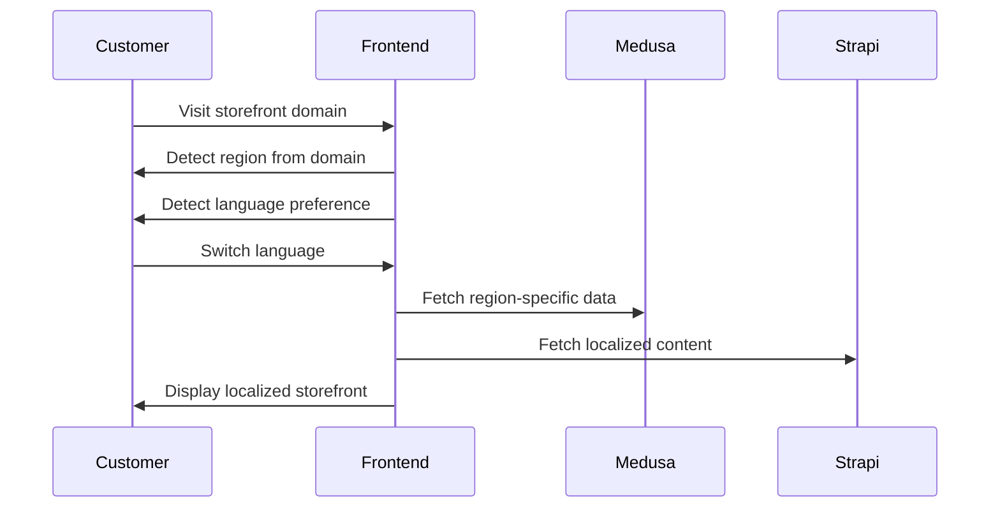

### Checkout Flow
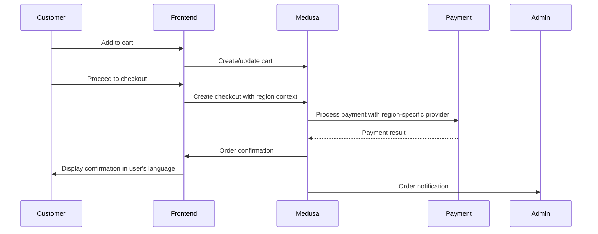

## System Integration Points

1. **Content to Commerce**: How product descriptions, images, and marketing content from Strapi connect to product catalog items in Medusa.js

2. **User Authentication**: Single sign-on approach across the platform

3. **Search Integration**: Unified search across products and content

4. **Analytics and Reporting**: Consolidated data from both systems

5. **Admin Workflows**: Streamlined processes that may span both systems

6. **Region Configuration**: How region settings in Medusa affect storefront behavior

7. **Language Management**: How content translations in Strapi are delivered to storefronts

## Multi-Region and Multi-Language Strategy

### Selected Architecture Approach
After evaluating multiple options, we've selected the **Single Medusa Instance with Region Module and Edge Caching** approach for the following reasons:

- **Simplified Development**: One codebase to maintain across all regions
- **Cost-Effectiveness**: Lower infrastructure requirements compared to multi-instance
- **Streamlined Operations**: Unified deployment and monitoring
- **Performance**: Edge caching for region-specific optimizations
- **Flexibility**: Region module provides sufficient customization for the three domains

### Region Configuration Schema
```typescript
// Example Medusa Region configuration
const regions = [
  {
    id: "nl",
    name: "Netherlands",
    currency_code: "EUR",
    tax_rate: 21,
    payment_providers: ["mollie", "ideal", "creditcard"],
    fulfillment_providers: ["postnl", "dhl_nl"],
    domain: "nl.example.com",
    languages: ["nl", "en"]
  },
  {
    id: "be",
    name: "Belgium",
    currency_code: "EUR",
    tax_rate: 21,
    payment_providers: ["mollie", "bancontact", "creditcard"],
    fulfillment_providers: ["bpost", "dhl_be"],
    domain: "be.example.com",
    languages: ["nl", "en"]
  },
  {
    id: "de",
    name: "Germany",
    currency_code: "EUR",
    tax_rate: 19,
    payment_providers: ["mollie", "sofort", "creditcard"],
    fulfillment_providers: ["dhl_de", "hermes"],
    domain: "de.example.com",
    languages: ["en"] // Possibly add "de" in future
  }
];
```

### Language Handling Implementation
```typescript
// Middleware for language detection and routing
const languageMiddleware = (req, res, next) => {
  // Extract region from domain
  const hostname = req.hostname;
  const region = regions.find(r => r.domain === hostname);
  
  // Determine language from query param, cookie, or accept-language header
  let language = req.query.lang || 
                 req.cookies.preferred_language || 
                 parseAcceptLanguage(req.headers["accept-language"]);
                 
  // Validate language is supported in region
  if (!region.languages.includes(language)) {
    language = region.languages[0]; // Default to first supported language
  }
  
  // Attach to request context
  req.region = region;
  req.language = language;
  
  next();
};
```

### Region Implementation
- Each of the three domains will be configured as a separate region in Medusa
- Regions will have their own currencies, tax rates, and payment providers
- Products can be available in all regions or specific regions using Sales Channels
- Region detection will primarily be based on the domain the user is visiting
- Edge caching will be implemented for region-specific performance optimization

### Language Implementation
- Two languages will be supported across all domains/regions
- Strapi will handle content localization with a multi-site approach
- Language selection will be persistent via cookies or local storage
- URLs will follow a coherent structure to maintain SEO value
- Default language will be determined by browser preferences or user history

### Integration Strategy
- Medusa Region Module will handle commerce aspects (pricing, shipping, etc.)
- Strapi's localization system will manage content in multiple languages
- Storefronts will request data with appropriate region and language parameters
- Admin interfaces will provide clear workflows for managing multi-region and multi-language settings

## Testing Strategy

### Multi-Region and Multi-Language Testing Approach
We've adopted a **Centralized Testing Framework with BDD Methodology** for comprehensive testing:

1. **Modular Structure**: Cypress framework with region/language parameterization
2. **BDD Format**: Gherkin syntax for business readability and requirements documentation
3. **Test Matrix**: Critical user journeys across all region/language combinations
4. **Visual Testing**: Secondary validation layer for key interfaces
5. **Functional Organization**: Tests structured by feature rather than by region

### Example Test Structure
```gherkin
Feature: Checkout Process
  
  Background:
    Given the system is configured for region "<region>"
    And the user has selected language "<language>"
    And the user has added region-specific products to cart
  
  Scenario Outline: Complete checkout with region-specific payment
    When the user proceeds to checkout
    Then they should see shipping options for region "<region>"
    And the shipping prices should be in the correct currency
    When they select a region-specific payment method
    And complete the payment process
    Then they should receive an order confirmation in "<language>"
    And the order should be created with the correct regional settings
    
    Examples:
      | region | language |
      | nl     | nl       |
      | nl     | en       |
      | be     | nl       |
      | be     | en       |
      | de     | en       |
```

### Test Configuration
```javascript
// Region/language configuration for tests
const testConfig = {
  regions: {
    nl: {
      domain: 'nl.example.com',
      languages: ['nl', 'en'],
      defaultLanguage: 'nl',
      currency: 'EUR',
      paymentMethods: ['ideal', 'creditcard'],
      sampleProducts: ['product_nl_1', 'product_nl_2']
    },
    be: {
      domain: 'be.example.com',
      languages: ['nl', 'en'],
      defaultLanguage: 'nl',
      currency: 'EUR',
      paymentMethods: ['bancontact', 'creditcard'],
      sampleProducts: ['product_be_1', 'product_be_2']
    },
    de: {
      domain: 'de.example.com',
      languages: ['en'],
      defaultLanguage: 'en',
      currency: 'EUR',
      paymentMethods: ['sofort', 'creditcard'],
      sampleProducts: ['product_de_1', 'product_de_2']
    }
  },
  
  // Test data for different languages
  translations: {
    checkoutTitle: {
      nl: 'Afrekenen',
      en: 'Checkout'
    },
    orderConfirmation: {
      nl: 'Bedankt voor je bestelling',
      en: 'Thank you for your order'
    }
  }
};
```

### Test Execution Strategy
- Run focused test suites for each region during development
- Execute full region/language matrix in nightly builds
- Prioritize critical flows for CI/CD integration
- Implement visual snapshot comparison for key user interfaces
- Generate region-specific test reports with detailed metrics

## Technical Decisions

- **Solace Medusa Starter**: Will be used as a foundation for the Medusa.js implementation to accelerate development
- **Database Choice**: PostgreSQL for both systems to simplify operations and maintenance
- **Deployment Strategy**: Docker-based containerization for consistent environments
- **CI/CD**: Automated testing and deployment pipelines with region and language coverage reporting
- **Monitoring**: Centralized logging and performance tracking with region-specific dashboards
- **Region Configuration**: Leveraging Medusa's built-in Region Module and Sales Channels
- **Content Localization**: Using Strapi's built-in localization capabilities
- **Frontend Framework**: Next.js for SEO-friendly, localized storefronts
- **Edge Caching**: CDN implementation for region-specific performance optimization

These patterns establish the foundation for a scalable, maintainable system that addresses the current limitations while providing a path for future growth. The multi-region and multi-language architecture ensures that the solution will support the business requirements for three distinct domains with two languages across all stores. 

# System Patterns

This document outlines the architectural patterns and design decisions for the Statamic to Medusa.js migration project, with a focus on multi-region and multi-language support.

## Core Architecture

The system follows a headless commerce architecture with the following components:

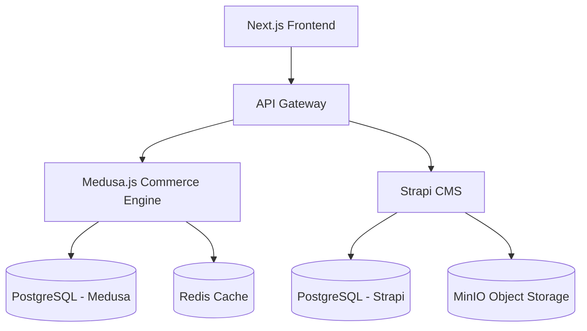

## Multi-Region Implementation

### Domain-Based Region Structure

The system uses a domain-based approach to region detection and configuration:

- **Netherlands**: example.nl (primary)
- **Belgium**: example.be
- **Germany**: example.de

Each domain is mapped to a specific Medusa.js region and sales channel, with appropriate configurations for:

- Currency (EUR for all regions)
- Tax rates (region-specific)
- Payment providers (region-specific)
- Shipping options (region-specific)

### Region Detection Flow

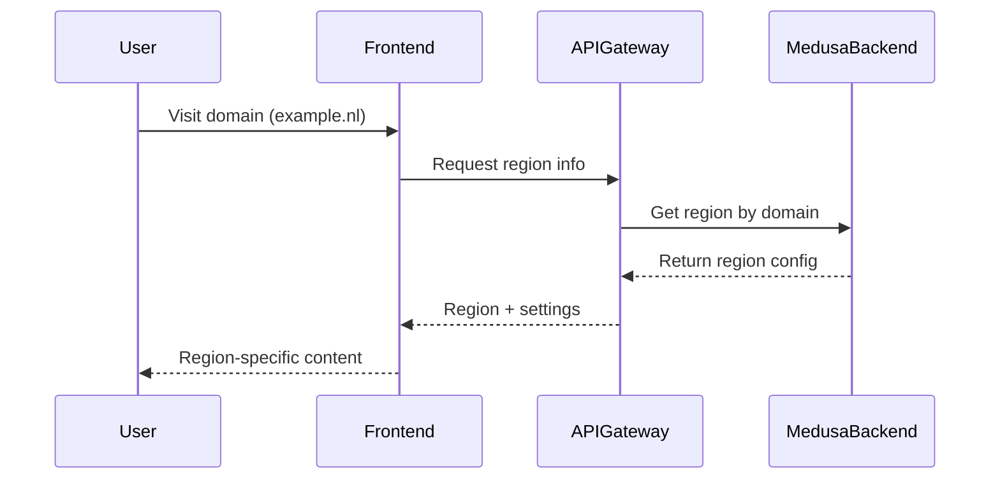

### Sales Channel Implementation

Sales channels are used to control product availability across regions:

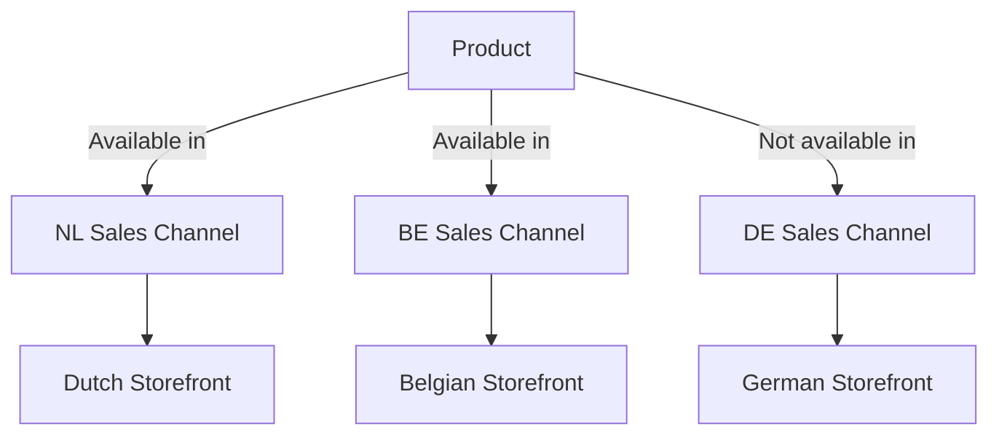

## Multi-Language Implementation

### Language Mapping

The system supports two primary languages:

- **Dutch (nl)**: Default language for Netherlands and Belgium regions
- **German (de)**: Default language for Germany region

### Content Translation Storage

Translations are handled across two systems:

1. **Medusa.js**: Product essential data translations (title, description) stored in metadata
2. **Strapi CMS**: Extended content translations managed through Strapi's i18n system

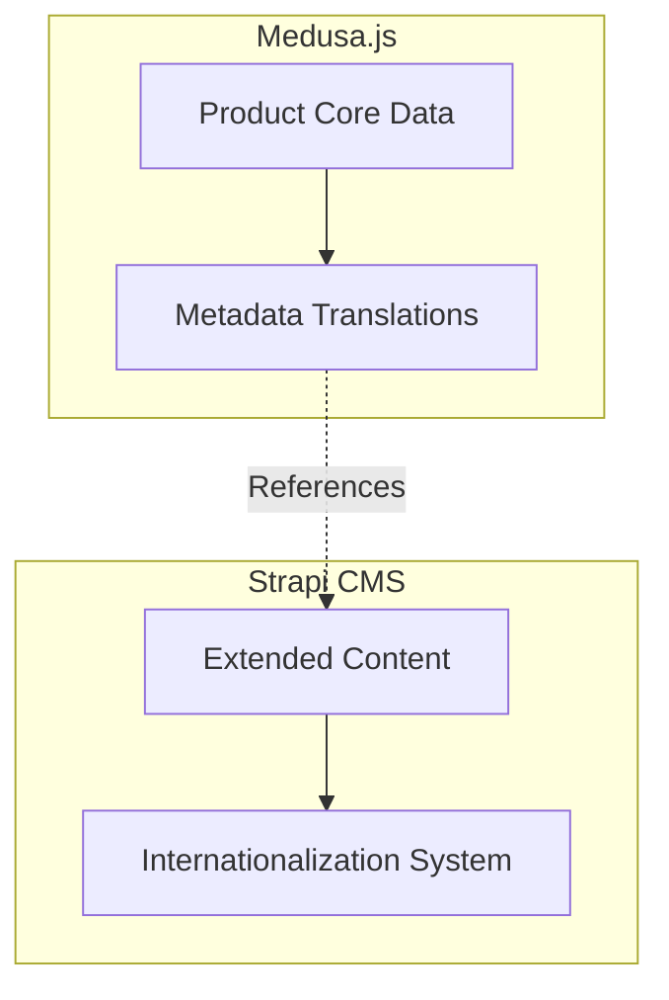

## Integration Patterns

### Medusa-Strapi Integration

The system implements a bidirectional integration between Medusa.js and Strapi:

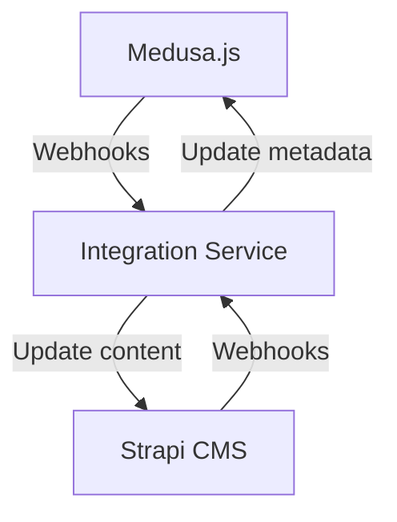

The integration service handles:
- Product creation/updates synchronization
- Region-specific content management
- Translation consistency across systems
- Media asset synchronization

### Frontend Integration

The Next.js frontend integrates with both systems:

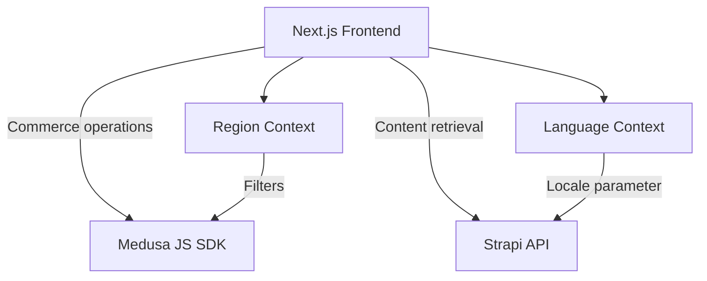

## Data Migration Patterns

### Product Migration Flow

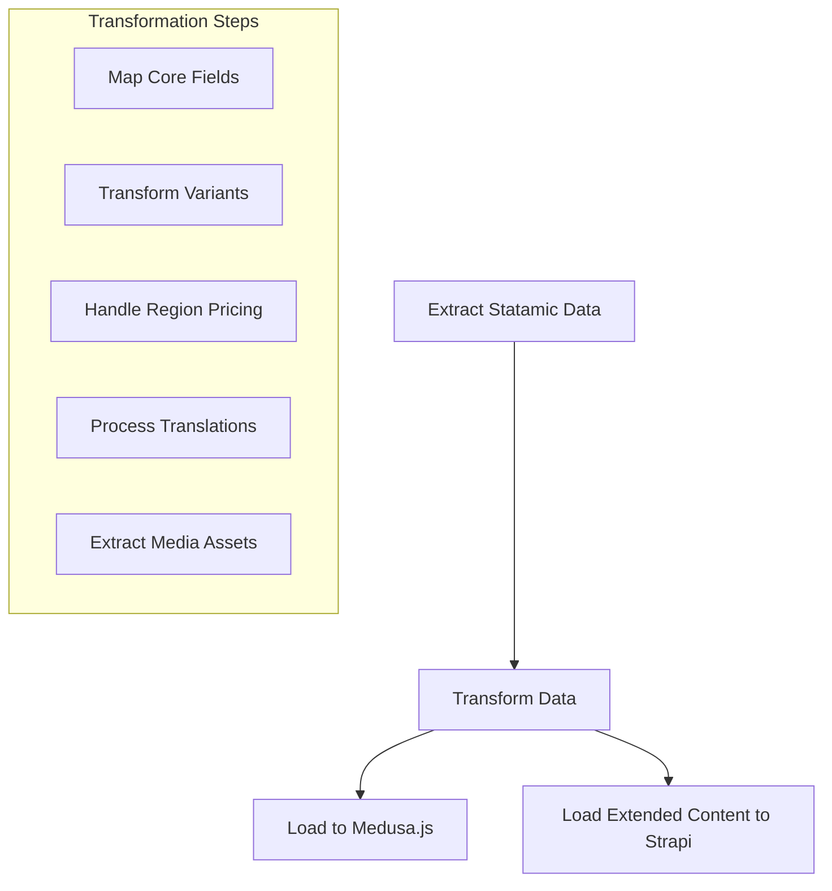

### Region-Specific Data Migration

For region-specific configurations:

1. **Default region assignments** based on Statamic availability flags
2. **Price list creation** for region-specific pricing
3. **Domain-specific content** mapped from Statamic globals to Strapi regional content

## Development Patterns

### Feature Flag System

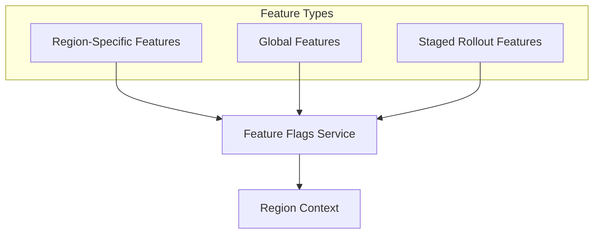

### Testing Strategy

The system employs:

1. **Region-specific test cases** to validate region functionality
2. **Language-specific tests** for translation validation
3. **Cross-region tests** to ensure consistency across storefronts
4. **Domain-specific routing tests** to verify correct region detection

## API Patterns

### Region-Aware API Structure

All APIs support region context:

```
GET /store/products?region_id=<region_id>
GET /api/content/pages?locale=<locale>&region=<region_id>
```

### Custom API Extensions

1. **Region detection endpoint**:
   ```
   GET /store/regions/detect
   ```

2. **Region switching endpoint**:
   ```
   POST /store/regions/switch
   ```

3. **Language preference endpoint**:
   ```
   POST /store/customer/preferences
   ```

## Deployment Patterns

### Multi-Domain Configuration

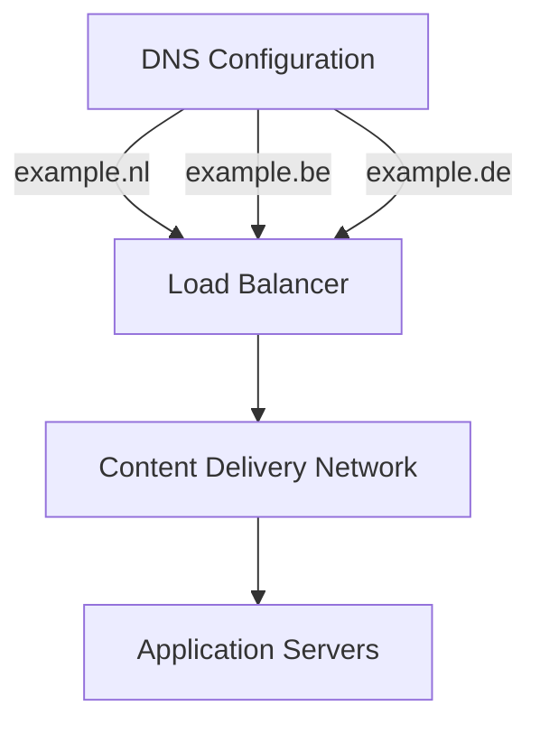

### Container Orchestration

Services are deployed as containerized applications with Kubernetes, allowing:

1. **Independent scaling** of Medusa.js and Strapi services
2. **Regional routing** through ingress controllers
3. **Shared database clusters** with appropriate connection pooling
4. **Redis-based caching** for performance optimization

## Security Patterns

### Cross-Domain Security

1. **CORS configuration** specific to each regional domain
2. **JWT-based authentication** with region context
3. **API rate limiting** per region and domain
4. **Region-specific data isolation** where appropriate

## Caching Strategy

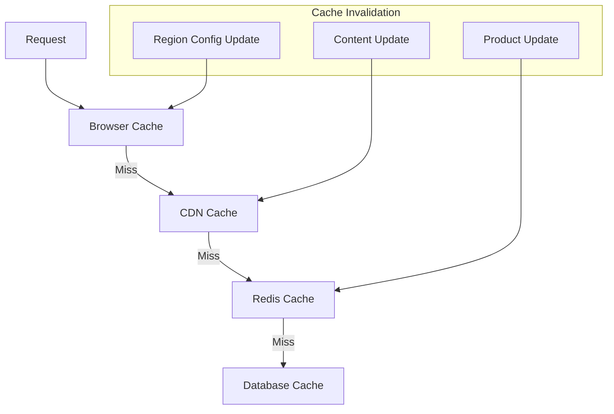

Redis is used for:
1. **Session storage** with region context
2. **Product cache** with region-specific variants
3. **Cart storage** linked to regions
4. **Region configuration cache** for quick access 