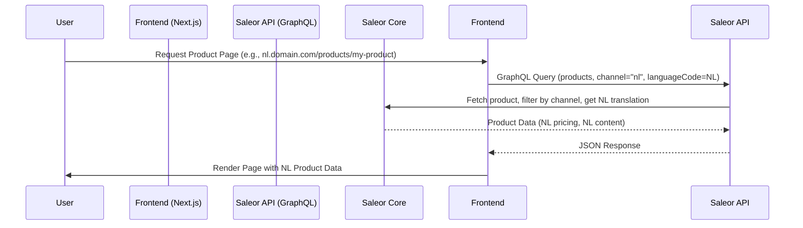
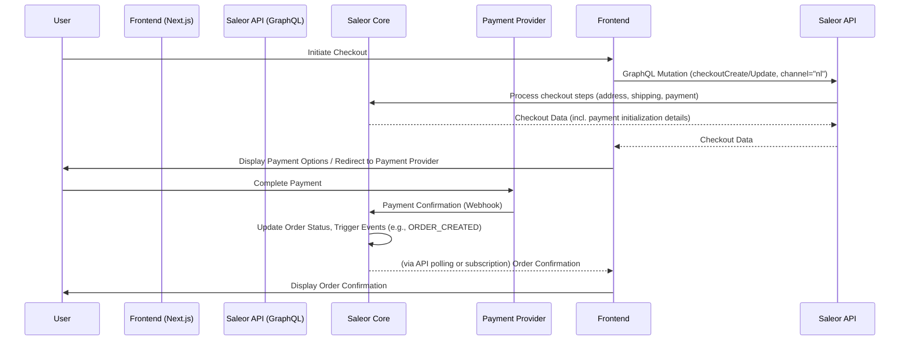
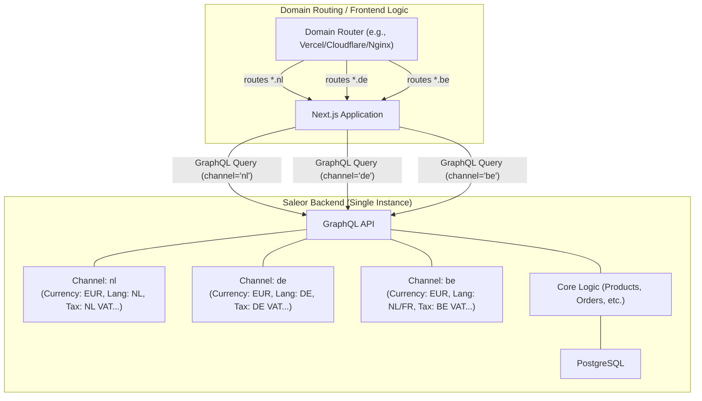
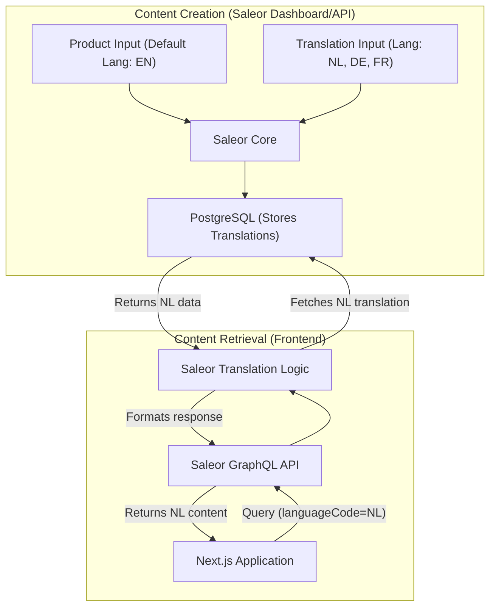
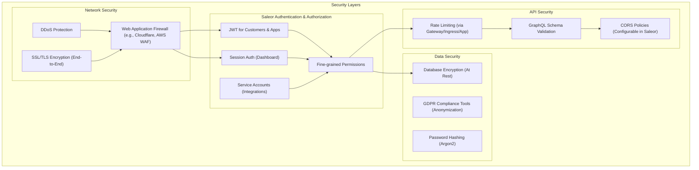

# System Architecture: Statamic to Saleor Migration

This document outlines the system architecture for the migration from Statamic CMS with Simple Commerce to **Saleor**, emphasizing Saleor's capabilities for multi-region (Channels) and multi-language support.

## Table of Contents

1.  [Architecture Overview](#architecture-overview)
2.  [Core Components (Saleor Platform)](#core-components-saleor-platform)
3.  [Integration Patterns](#integration-patterns)
4.  [Data Flow Examples](#data-flow-examples)
5.  [Multi-Region Architecture (Saleor Channels)](#multi-region-architecture-saleor-channels)
6.  [Multi-Language Support (Saleor Translations)](#multi-language-support-saleor-translations)
7.  [Deployment Architecture](#deployment-architecture)
8.  [Security Architecture](#security-architecture)
9.  [Scalability Considerations](#scalability-considerations)

## Architecture Overview

The new architecture leverages **Saleor** as a unified, headless platform for both commerce functionality and core content management. This eliminates the need for separate commerce and CMS backends, simplifying the stack.

```mermaid
graph TD
    subgraph "Client Applications"
        StorefrontApp["Storefront (Next.js)"]
        AdminDashboard["Admin (Saleor Dashboard)"]
        MobileApp["Mobile App (Future)"]
    end

    subgraph "Saleor Platform (Unified Backend)"
        GraphQL_API["GraphQL API"]
        CoreServices["Core Services (Products, Orders, Customers, Checkout)"]
        ChannelMgmt["Channel Management (Multi-Region)"]
        ContentMgmt["Content Management (Pages, Attributes)"]
        TranslationMgmt["Translation Management (Multi-Language)"]
        PaymentShipping["Payment & Shipping Modules"]
        MediaMgmt["Media Management"]
        EventSystem["Event System / Webhooks"]
    end

    subgraph "Infrastructure"
        CDN["Content Delivery Network"]
        DBSaleor["PostgreSQL (Saleor)"]
        Redis["Redis (Cache/Queue)"]
        S3["S3 Storage (Media)"]
        Search["Search Engine (Optional App)"]
    end

    StorefrontApp --> CDN
    AdminDashboard --> GraphQL_API
    MobileApp --> CDN

    CDN --> GraphQL_API  // For API calls from edge/frontend

    GraphQL_API --- CoreServices
    GraphQL_API --- ChannelMgmt
    GraphQL_API --- ContentMgmt
    GraphQL_API --- TranslationMgmt
    GraphQL_API --- PaymentShipping
    GraphQL_API --- MediaMgmt
    GraphQL_API --- EventSystem

    CoreServices --> DBSaleor
    ContentMgmt --> DBSaleor
    ChannelMgmt --> DBSaleor
    TranslationMgmt --> DBSaleor

    CoreServices --- Redis
    MediaMgmt --> S3
    CoreServices --> Search

    EventSystem --> WebhookHandlers[External Webhook Handlers]

```

## Core Components (Saleor Platform)

Saleor provides a comprehensive set of modules and features:

1.  **GraphQL API**: The primary interface for all interactions (frontend, admin, integrations).
2.  **Product Catalog**: Manages products, variants, attributes, collections, categories. Supports rich attributes and flexible product types.
3.  **Checkout & Cart**: Handles the shopping cart and multi-step checkout process.
4.  **Order Management**: Manages order lifecycle, payments, fulfillment, and returns.
5.  **Customer Management**: Manages customer accounts, addresses, and authentication (JWT-based).
6.  **Channel Management**: **Crucial for multi-region**. Defines separate sales channels (e.g., NL, DE, BE) with distinct configurations (currency, pricing, availability, shipping, taxes).
7.  **Content Management**: Built-in capabilities for managing product descriptions, page content (via Page Types/Attributes), and other content elements directly linked to commerce objects.
8.  **Translation Management**: **Crucial for multi-language**. Supports translations for various models (products, categories, attributes, pages) via the Translation API.
9.  **Payment & Shipping Modules**: Integrates with various payment gateways and shipping providers, configurable per Channel.
10. **Media Management**: Handles image uploads, processing, and storage (often delegated to external storage like S3).
11. **Event System & Webhooks**: Enables asynchronous communication and integration with external systems based on Saleor events.
12. **Permission System**: Fine-grained role-based access control for staff users via the Saleor Dashboard.
13. **Extensibility (Apps)**: Allows extending Saleor functionality through external applications communicating via webhooks and the GraphQL API (e.g., for external search, CMS sync if needed, custom logic).

## Integration Patterns

Integration focuses on connecting Saleor to external services or the frontend:

1.  **Frontend <-> Saleor**: Primarily via the GraphQL API using clients like Apollo or urql in Next.js.
2.  **Saleor <-> Payment Gateways**: Via Saleor's Payment Apps/Plugins, configured per Channel. Communication often involves redirects and webhooks.
3.  **Saleor <-> Shipping/Fulfillment**: Via Saleor's Shipping Methods and Apps, often involving API calls and webhooks.
4.  **Saleor <-> External Systems (ERP, PIM, etc.)**: Via Saleor Apps, using GraphQL API and Webhooks for synchronization.
5.  **Data Migration**: One-time process using custom scripts interacting with the Saleor GraphQL API (mutations) to import transformed Statamic data.

## Data Flow Examples

### Product Browsing Flow (Saleor)



### Checkout Flow (Saleor)



## Multi-Region Architecture (Saleor Channels)

Multi-region support is natively handled by Saleor's **Channel** system:



1.  **Domain Routing**: External routing (DNS, Load Balancer, or CDN) directs traffic from `nl.domain.com`, `de.domain.com`, `be.domain.com` to the Next.js frontend.
2.  **Frontend Context**: The Next.js application detects the domain/region and includes the corresponding `channel` slug (e.g., "nl", "de", "be") in its GraphQL API requests to Saleor.
3.  **Saleor Channels**: Saleor filters data (products, pricing, availability) and applies rules (taxes, shipping, payments) based on the `channel` specified in the API request. A single product can exist across multiple channels with different settings.

## Multi-Language Support (Saleor Translations)

Multi-language support leverages Saleor's integrated translation system:



1.  **Content Input**: Content is created in a default language, and translations are added for supported languages via the Saleor Dashboard or API.
2.  **Storage**: Saleor stores translations alongside the original content in the PostgreSQL database.
3.  **Frontend Request**: The Next.js frontend includes the desired `languageCode` (e.g., `NL`, `DE`, `FR`, `EN`) in its GraphQL queries.
4.  **Saleor Response**: Saleor retrieves the content for the requested language, falling back to the default language if the translation doesn't exist.

## Deployment Architecture

Deployment typically involves containerizing Saleor and the Next.js frontend:

```mermaid
graph TD
    subgraph "Cloud Infrastructure (e.g., AWS, K8s)"
        LoadBalancer["Load Balancer / Ingress"]

        subgraph "Saleor Deployment"
            SaleorAPI["Saleor API Pods (Stateless)"]
            SaleorWorker["Saleor Worker Pods (Background Tasks)"]
            SaleorDashboard["Saleor Dashboard Pod (Optional Internal)"]
        end

        subgraph "Frontend Deployment"
            NextJsSSR["Next.js SSR/ISR Pods (Optional)"]
            StaticHosting["Static Hosting (Vercel/Netlify/S3+CDN)"]
        end

        subgraph "Managed Services"
            RDS["PostgreSQL RDS"]
            ElastiCache["Redis ElastiCache"]
            S3Bucket["S3 Bucket (Media)"]
        end

        LoadBalancer --> SaleorAPI
        LoadBalancer --> NextJsSSR
        LoadBalancer --> StaticHosting // Or CDN direct

        SaleorAPI --- RDS
        SaleorWorker --- RDS
        SaleorDashboard --- RDS

        SaleorAPI --- ElastiCache
        SaleorWorker --- ElastiCache

        SaleorAPI --> S3Bucket // via Presigned URLs
        SaleorDashboard --> S3Bucket

        NextJsSSR --> SaleorAPI
        StaticHosting --> SaleorAPI // Client-side calls
    end
```

-   **Saleor**: Deployed as containerized services (API, Worker, potentially Dashboard). Stateless, allowing horizontal scaling.
-   **Next.js**: Can be deployed as server-rendered pods or static hosting (Vercel, Netlify, S3/CloudFront) depending on rendering strategy (SSR/ISR/SSG).
-   **Databases/Cache**: Managed cloud services (RDS, ElastiCache) are recommended for reliability and scalability.
-   **Media**: Offloaded to object storage (S3).

## Security Architecture

Leverages Saleor's built-in security features and standard web practices:



-   Focus on configuring Saleor's permission system correctly.
-   Securing API access for frontend and Saleor Apps.
-   Standard network security (WAF, DDoS, TLS).
-   Ensuring GDPR compliance using Saleor's tools.

## Scalability Considerations

Saleor's architecture supports scalability:

1.  **Stateless Core**: Saleor API/Worker instances are stateless, allowing easy horizontal scaling behind a load balancer.
2.  **Database Scaling**: Utilize PostgreSQL read replicas to handle high read loads. Connection pooling is essential.
3.  **Asynchronous Tasks**: Saleor Workers handle background tasks (webhooks, thumbnail generation) via Redis queue, offloading work from the API.
4.  **Caching**: Redis is used extensively for caching API responses and internal data, reducing database load. CDN and frontend caching further enhance performance.
5.  **Optimized Queries**: GraphQL allows fetching only necessary data, reducing payload size.

## Conclusion

This architecture utilizes **Saleor** as the central platform for both commerce and content, simplifying the stack compared to a separate CMS/Commerce engine approach. Key advantages include:

1.  Unified data model and API (GraphQL).
2.  Native multi-region support via **Channels**.
3.  Integrated multi-language support via the **Translation API**.
4.  Robust event system for integrations.
5.  Scalable and secure by design.

The migration will focus on transforming Statamic data into Saleor's structure and leveraging Saleor's features for multi-region and multi-language requirements, implemented primarily through the **Channel** and **Translation** systems. 